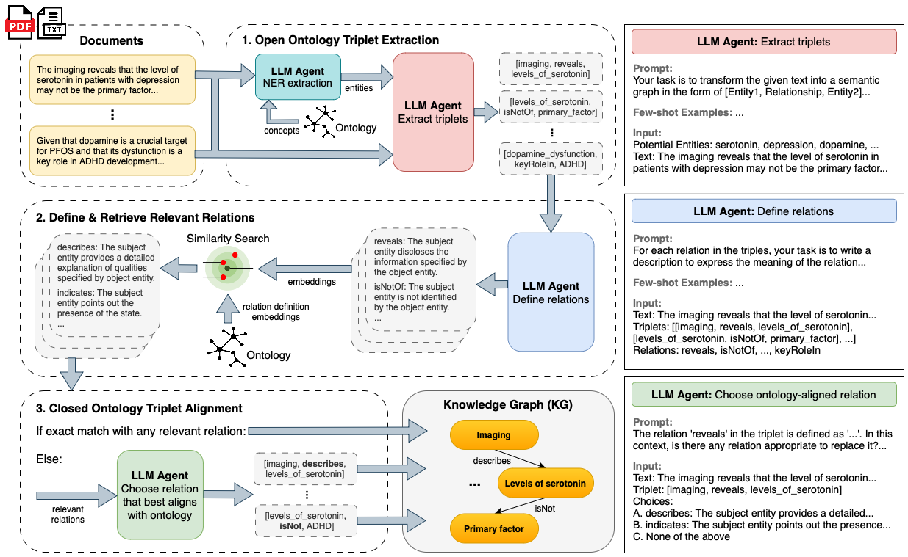

<h1>Brain2KG: A Multi-Agent Framework for Neuroscience Knowledge Graph Construction & Validation</h1>



## Brain2KG Overview

This framework leverages multiple agents to process neuroscience documents, extracting, defining, and aligning triplet relations with a predefined ontology. The result is a knowledge graph (KG) that is consistent with the given ontology, ensuring accurate representation of the extracted information.

## Framework Stages

### OIE: Open Information Extraction

In the first stage, neuroscience documents are fed into the framework. An LLM agent performs Named Entity Recognition (NER) to identify relevant entities within the text. These entities are then used to extract triplets in the form `[Entity1, Relationship, Entity2]`. This process transforms unstructured text into structured data, forming the initial set of triplets.

### SD: Schema Definition

The second stage involves defining and retrieving relevant relations for the extracted triplets. The LLM agent defines the relationships within the triplets by providing descriptions that express the meaning of each relation. Using similarity search, these relation definitions are then embedded and compared to the ontology embeddings to find the most relevant matches.

### SA: Schema Alignment

In the final stage, the defined triplets are aligned with the predefined ontology. The LLM agent selects the best matching relations from the ontology for each triplet. If an exact match is not found, the agent chooses the closest relevant relation. This process ensures that the triplets are consistent with the given ontology, resulting in an ontology-aligned knowledge graph (KG) that accurately represents the extracted information.

### KGV: Knowledge Graph Validation

WIP

## Usage Instructions

### Via `run.py`

Install requirements using a Poetry environment:

```bash
poetry install
```

Run Brain2KG EDA framework by executing `poetry run python run.py --options`:

```bash
poetry run python run.py \
    --oie_llm {oie_llm} \
    --oie_prompt_template_file_path {oie_prompt_template_file_path} \
    --oie_few_shot_example_file_path {oie_few_shot_example_file_path} \
    --sd_llm {sd_llm} \
    --sd_prompt_template_file_path {sd_prompt_template_file_path} \
    --sd_few_shot_example_file_path {sd_few_shot_example_file_path} \
    --sa_target_schema_file_path {sa_target_schema_file_path} \
    --sa_llm {sa_llm} \
    --sa_embedding_model {sa_embedding_model} \
    --sa_prompt_template_file_path {sa_prompt_template_file_path} \
    --input_text_file_path {input_text_file_path} \
    --output_dir {output_dir}
```

You can also run an example using WebNLG ontology:

```bash
poetry run python run.py
```

Or a custom neuroscience-domain example using `gemma2:9b` LLM agents:

```bash
poetry run python run.py \
    --oie_llm gemma2:9b \
    --sd_llm gemma2:9b \
    --sa_target_schema_file_path schemas/neuro_schema.csv \
    --sa_llm gemma2:9b \
    --input_text_file_path data/raw_text/neuro_data.txt
```

### Via FastAPI endpoints 

Create an `.env.development` file in the `brain2kg/api/` directory containing:

```
ENV_STATE=dev
DATABASE_URL=sqlite:///data.db
DB_FORCE_ROLL_BACK=False
LOGTAIL_API_KEY=
POSTGRES_PORT=5432
POSTGRES_USER=postgres
POSTGRES_PASSWORD=
JWT_POSTGRES_TABLE_USER_SCOPE_REL=
POSTGRES_DB=
POSTGRES_SERVER=db
JWT_POSTGRES_TABLE_USER=
JWT_POSTGRES_TABLE_SCOPE=
JWT_ALGORITHM=
JWT_SECRET_KEY=
```

Run the Docker containers by executing the `docker-compose.yml` file:

```bash
docker compose up --build
```

To test the Brain2KG EDA framework via endpoint, either navigate to `http://localhost:8000/docs` or make a curl request:

```bash
curl -X 'GET' \
  'http://localhost:8000/eda' \
  -H 'accept: application/json' \
  -H 'Content-Type: application/json' \
  -d '{
  "oie_settings": {
    "oie_llm": {oie_llm},
    "oie_prompt_template_file_path": {oie_prompt_template_file_path},
    "oie_few_shot_example_file_path": {oie_few_shot_example_file_path}
  },
  "sd_settings": {
    "sd_llm": {sd_llm},
    "sd_prompt_template_file_path": {sd_prompt_template_file_path},
    "sd_few_shot_example_file_path": {sd_few_shot_example_file_path}
  },
  "sa_settings": {
    "sa_target_schema_file_path": {sa_target_schema_file_path},
    "sa_llm": {sa_llm},
    "sa_embedding_model": {sa_embedding_model},
    "sa_prompt_template_file_path": {sa_prompt_template_file_path}
  },
  "input_file_path": {
    "input_text_file_path": {input_text_file_path}
  },
  "output_dir_path": {
    "output_dir": {output_dir}
  }
}'
```

<i>Note: Custom prompts can be set for each agent, though this is not recommended.</i>
