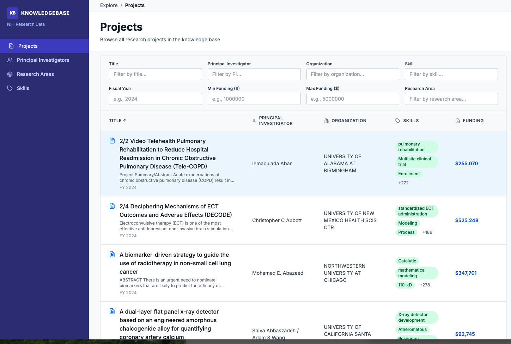
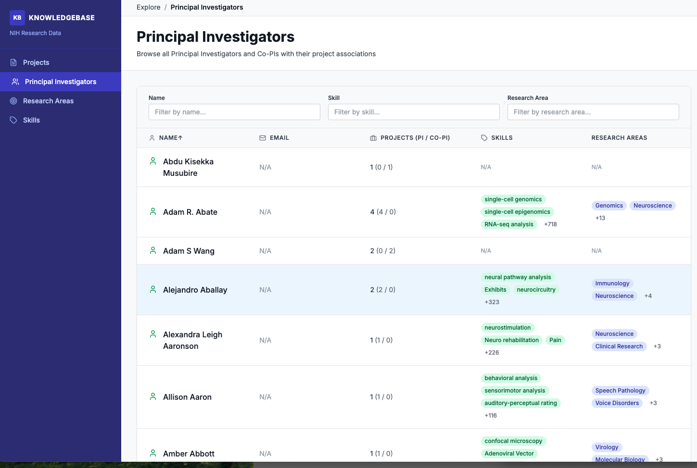
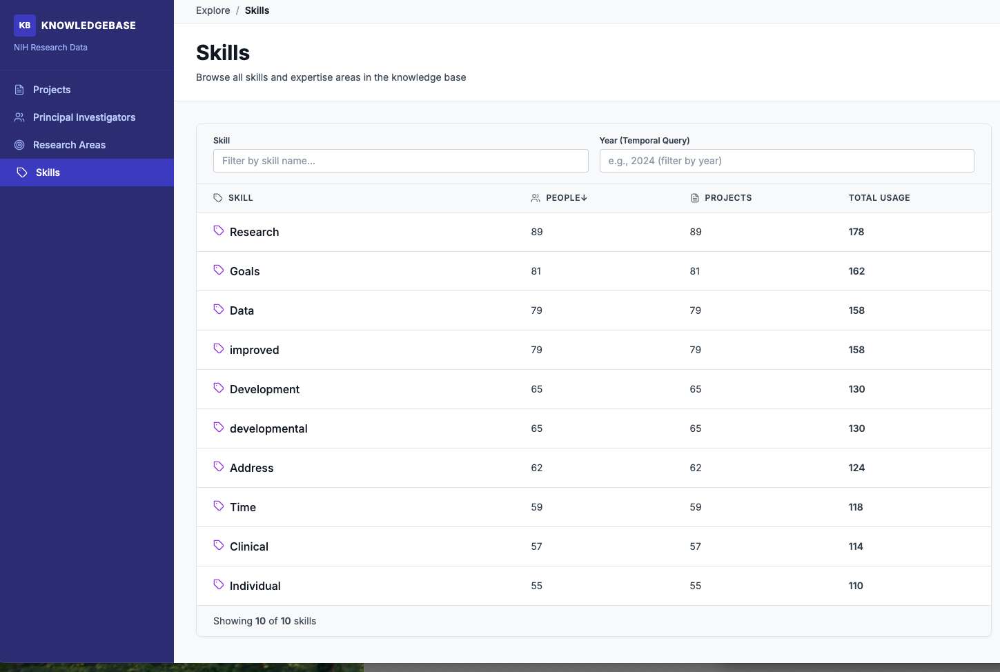
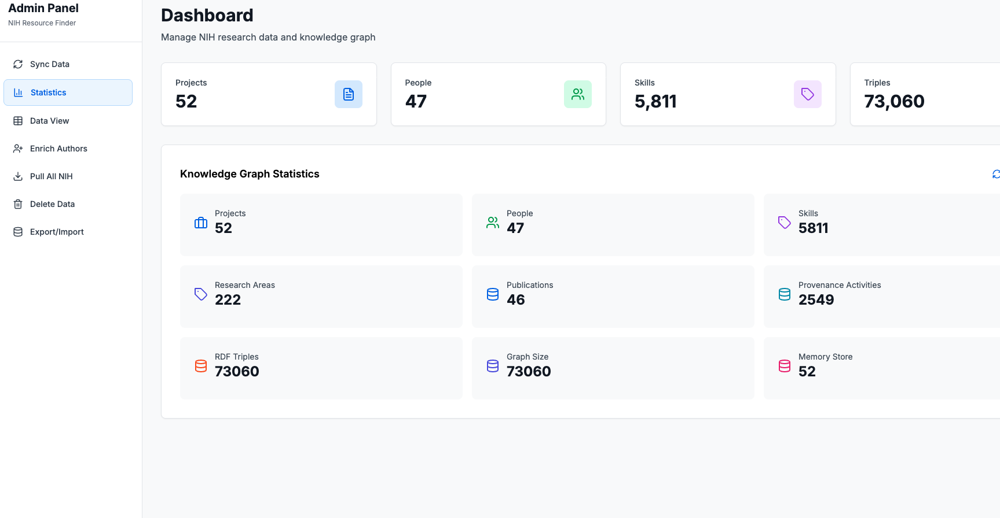
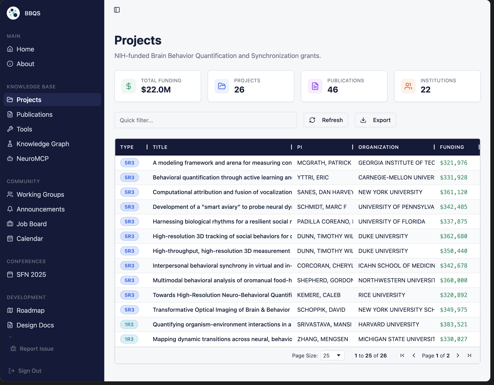

# Construction of Enriched Research Knowledge Graphs and an Interactive User Interface for Project Grants and Research Findings

## Overview 
This document builds on ongoing discussions in Slack and consolidates ideas, requirements, and early explorations related to research knowledge graph construction and user interface design. Its purpose is to provide a unified and concrete design reference that connects these discussions with an evolving implementation.

The screenshots included in this document reflect early explorations of knowledge graph structure, enrichment pipelines, and user interaction patterns. These artifacts ground the design in practical progress and serve as shared reference points for feedback and iteration.

The figures (from @tekrajchhetri and @Sulstice) below illustrate components of the current proof-of-concept (PoC), including project- and PI-centered views, skill representations, summary statistics, and related explorations across systems. Together, they demonstrate early capabilities and help contextualize the design decisions discussed in this document.

By bringing together concepts discussed across channels, PoC artifacts, and related efforts, this document aims to align define scope, tasks and connect parallel work streams. 

## Use Cases

The following use cases illustrate scenarios where this system provides value.

1. **Understand Funding Landscape and Expertise**  
   *As a program manager,* I want to explore funding information across projects and investigators so that I can understand who has received funding, what skills and research areas are being supported, and how funded work connects to outcomes.

2. **Discover People and Skills Behind Funded Research**  
   *As a researcher or PI,* I want to find people working in specific funded areas and understand their skills, projects, and publications so that I can identify potential collaborators and align my work with existing efforts.

3. **Assess Impact and Identify Strategic Opportunities**  
   *As a research leader,* I want to connect funding, people, skills, and findings in one place so that I can evaluate research impact, identify gaps or overlaps, and make informed strategic decisions.

## Goals

The goals of this work are to:

1. **Construct enriched research knowledge graphs** capturing project funding, principal investigators (PIs), and projects, and automatically enrich them with related information such as publications, publication-derived findings, skills, and research areas.

2. **Build and extend an interactive user interface** that supports user interactions for searching, browsing, and navigating the knowledge graphs to discover related and connected information.

3. **Integrate and align with existing cross-project efforts**, including BICAN, BBQS, and Connects. The intent is not to duplicate existing work, but to reuse, connect, and extend shared data, infrastructure, and capabilities across these projects where appropriate.

## Requirements

The following requirements guide the design and implementation of the system.

### Knowledge Graph Requirements

1. **RDF-based Knowledge Graph**  
   The knowledge graph **must be represented in RDF**, enabling interoperability, standard semantic modeling, and compatibility with existing semantic web tools and query languages (e.g., SPARQL).

2. **Defined Ontology and Schema**  
   A clear and extensible **ontology and schema must be defined** to model core entities and relationships, including projects, funding, principal investigators (PIs), publications, findings, skills, and research areas. The ontology should support reuse and alignment with existing vocabularies where applicable.

3. **First-Class Provenance**  
   **Provenance must be treated as a first-class concern** across the knowledge graph. The system should capture and represent provenance information for entities and relationships using the **W3C PROV-O (PROV ontology)** to ensure traceability of data sources, extraction processes, and temporal evolution, if any.

---

### User Interface Requirements

4. **Search and Discovery**  
   The user interface **must support intuitive keyword-based search and discovery** across core entities (e.g., projects, PIs, grants, publications, skills, and research areas), with results grounded in the underlying knowledge graph. The search experience should prioritize simplicity and clarity, similar to the interaction patterns demonstrated in the reference screenshots (e.g., CivicDB-style exploration).

5. **Easy and Intuitive Navigation**  
   The UI **must enable easy and intuitive navigation across related entities**, allowing users to move seamlessly between projects, funding, PIs, skills, publications, and findings through clearly visible relationships, as demonstrated in the existing proof-of-concept views.

6. **User Feedback and Correction**  
   The UI **should allow users to provide feedback or suggest corrections** on entities and relationships (e.g., incorrect associations, missing information), supporting iterative improvement of the knowledge graph over time.

7. **Administrative Data Ingestion and Management**  
   The system **must provide an administrative interface** that allows authorized users to configure and trigger data ingestion from external sources. This interface should support updating, refreshing, and managing source data so that the knowledge graph can be **automatically constructed and updated** based on incoming data.

**Important:** In BrainKB we are working towards the direction of model-driven UI, we should follow that approach so that UI is generalizable and can be re-used across projects.
### Backend and Platform Requirements

8. **Service-Oriented Backend (Microservices)**  
   The backend **should be composed of services** that support the core operations required by the UI and knowledge graph lifecycle, including ingestion, extraction/enrichment, indexing/search, graph query, and export/import. Services should expose stable APIs to enable UI evolution without tightly coupling to implementation details.

9. **Background Jobs for Long-Running Operations**  
   The system **must support background/asynchronous execution** for time-consuming operations such as bulk ingestion, document processing, entity extraction, graph enrichment, and large exports. Job status, progress, and errors should be trackable (at minimum for admin users).

10. **Import and Export of Knowledge Graphs**  
   The system **must support importing and exporting knowledge graphs** to enable reproducibility, portability, backups, and integration with other systems. Export should support RDF-native formats (e.g., Turtle / RDF/XML / N-Triples) and preserve provenance information.

11. **Scalability and Reliability for Large Data**  
   The backend **should be designed to handle large and growing datasets**, including large numbers of projects, publications, and extracted findings. Key operations (ingestion, search, and graph navigation queries) should remain reliable under increasing load through batching, pagination, caching, and appropriate storage/indexing strategies.

## Tasks

The work will be organized into the following major task areas:

### 1. User Interface Design and Development
- Design and iterate on UI flows for search, discovery, and easy navigation across the knowledge graph, informed by existing PoC screenshots and user feedback.
- Implement user-facing views for exploring projects, funding, PIs, skills, publications, and findings.
- Support mechanisms for users to provide feedback or suggest corrections to entities and relationships.
- Design and implement administrative UI components for managing data ingestion and monitoring background jobs.

### 2. Ontology/Schema Modeling
- Define and document the RDF-based ontology and schema for core entities and relationships (e.g., projects, grants, PIs, publications, findings, skills, research areas).
- Develop and maintain **LinkML schemas** to formally specify the data model, constraints, and relationships, and to support validation, documentation, and code generation.
- Align and reuse existing vocabularies and ontologies where applicable, mapping LinkML models to RDF representations.
- Model provenance as a first-class concern using **PROV-O**, covering data sources, extraction processes, and updates.
- Iterate on the schema and LinkML models based on data availability, UI needs, and cross-project integration requirements.

### 3. Backend Services and Knowledge Graph Construction
- Design and implement backend microservices to support ingestion, enrichment, search, and graph query operations.
- Implement automated pipelines for extracting publications, findings, skills, and research areas from external sources.
- Support long-running and large-scale operations using background jobs, including ingestion, and enrichment.
- Enable import and export of knowledge graphs in RDF-native formats, preserving provenance and metadata.
- Integrate backend services with the UI and administrative interfaces.
