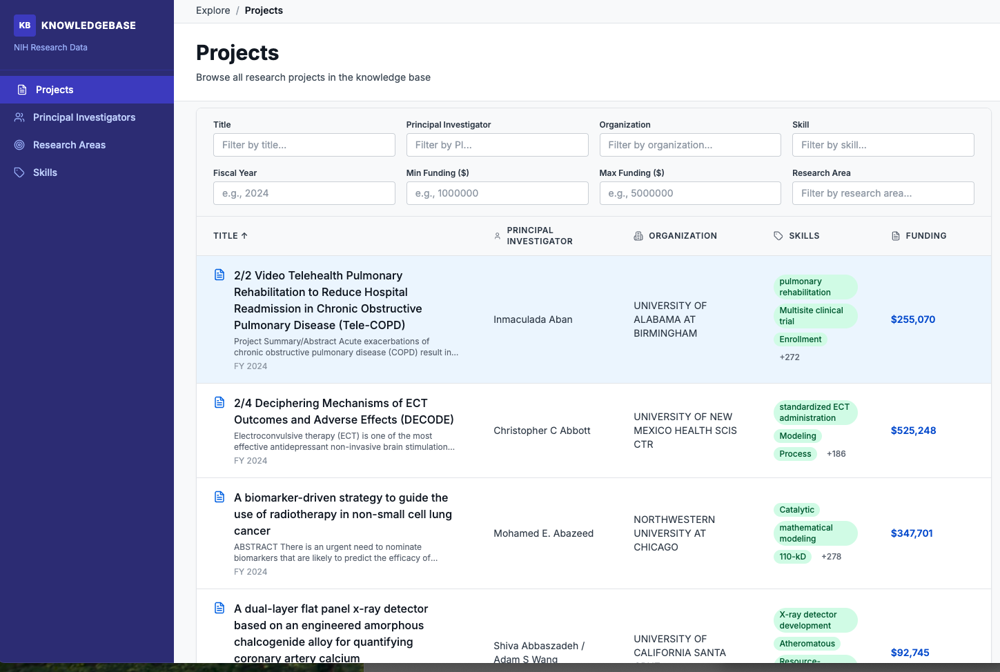
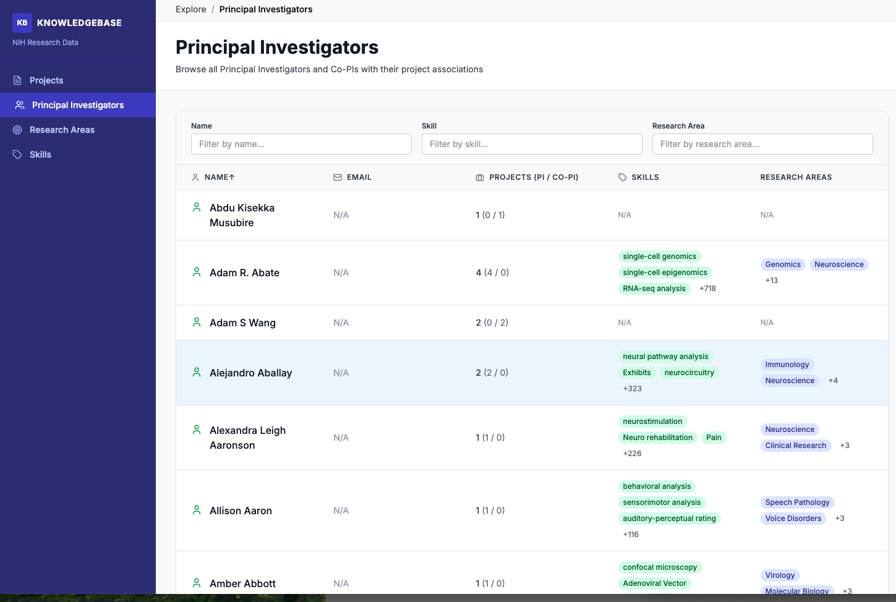
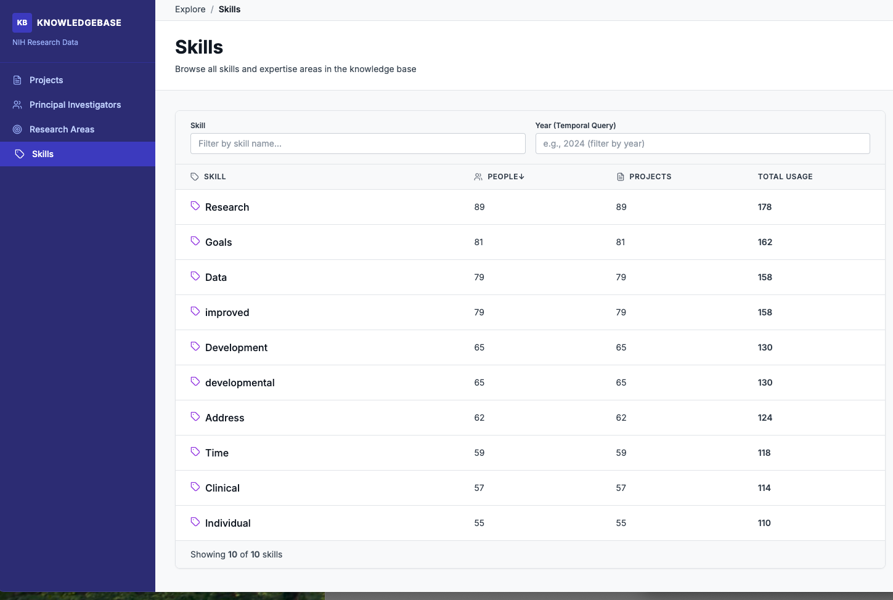
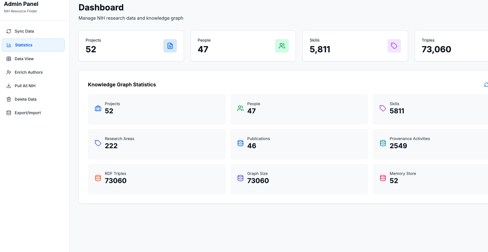
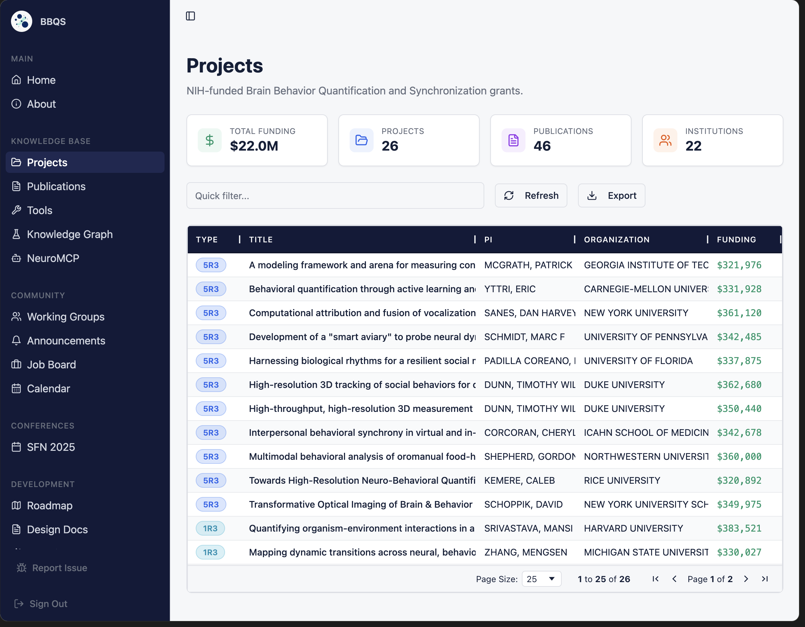
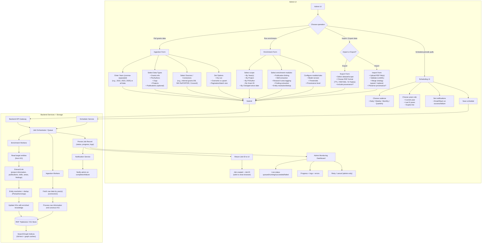
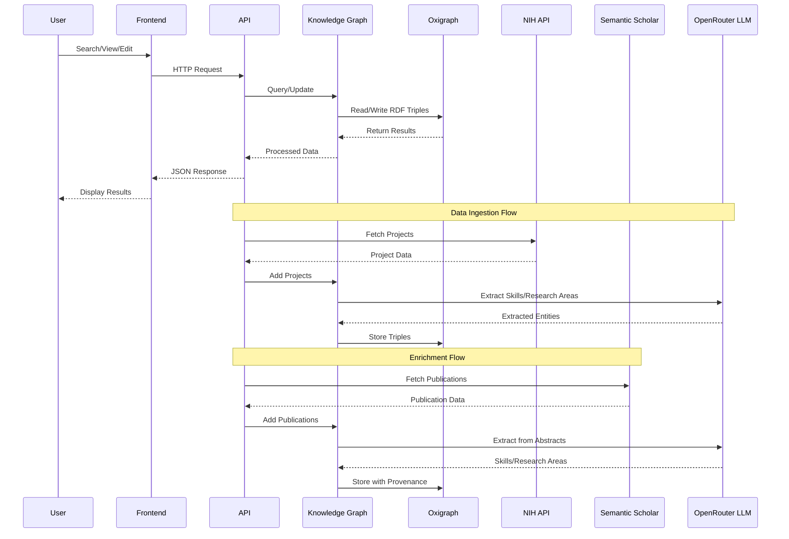

# Construction of Enriched Research Knowledge Graphs and an Interactive User Interface for Project Grants and Research Findings

## Overview 
This document builds on ongoing discussions in Slack and consolidates ideas, requirements, and early explorations related to research knowledge graph construction and user interface design. Its purpose is to provide a unified and concrete design reference that connects these discussions with an evolving implementation.

The screenshots included in this document reflect early explorations of knowledge graph structure, enrichment pipelines, and user interaction patterns. These artifacts ground the design in practical progress and serve as shared reference points for feedback and iteration.

The figures (from @tekrajchhetri and @Sulstice) below illustrate components of the current proof-of-concept (PoC), including project- and PI-centered views, skill representations, summary statistics, and related explorations across systems. Together, they demonstrate early capabilities and help contextualize the design decisions discussed in this document.

By bringing together concepts discussed across channels, PoC artifacts, and related efforts, this document aims to align define scope, tasks and connect parallel work streams. 

## Use Cases

The following use cases illustrate scenarios where this system provides value.

1. **Understand Funding Landscape and Expertise**  
   *As a program manager,* I want to explore funding information across projects and investigators so that I can understand who has received funding, what skills and research areas are being supported, and how funded work connects to outcomes.

2. **Discover People and Skills Behind Funded Research**  
   *As a researcher or PI,* I want to find people working in specific funded areas and understand their skills, projects, and publications so that I can identify potential collaborators and align my work with existing efforts.

3. **Assess Impact and Identify Strategic Opportunities**  
   *As a research leader,* I want to connect funding, people, skills, and findings in one place so that I can evaluate research impact, identify gaps or overlaps, and make informed strategic decisions.

## Goals

The goals of this work are to:

1. **Construct enriched research knowledge graphs** capturing project funding, principal investigators (PIs), and projects, and automatically enrich them with related information such as publications, publication-derived findings, skills, and research areas.

2. **Build and extend an interactive user interface** that supports user interactions for searching, browsing, and navigating the knowledge graphs to discover related and connected information.

3. **Integrate and align with existing cross-project efforts**, including BICAN, BBQS, and Connects. The intent is not to duplicate existing work, but to reuse, connect, and extend shared data, infrastructure, and capabilities across these projects where appropriate.

**Estimated deadline for completion: June, 30 2026.**

## Requirements

The following requirements guide the design and implementation of the system.

1. The Knowledge Graphs (KGs) must be backed by a clearly defined, and machine-readable ontology or schema that formally specifies core entities, relationships, and constraints, ensuring interoperability, validation, and long-term maintainability.
2. Provenance should be treated as a first-class citizen and **W3C PROV-O (PROV ontology)** should be reused.
3. Grant data must be downloaded, transformed into KGs and stored locally, and all API queries and operations must use this locally stored enriched KG as the primary data source.
4. The system should provide capabilities to perform automated knowledge graph enrichment using AI agents, enabling extraction, linking, and augmentation of entities and relationships from external and unstructured sources, e.g., publications.
4. The KGs are stored in graph database, such as Oxigraph.
4. The API must support asynchronous execution for long-running and resource-intensive operations (e.g., KG ingestion and enrichment), enabling background processing with job tracking independent of client session state.
5. The implementation must check for existing data (e.g., project records) before retrieving new information, ensuring deduplication and avoiding unnecessary re-fetching or duplication of data, e.g., grant and publication informations.
6. The system must provide search features allowing one to search skills, projects PIs, and Co-PIs.
6.  The user interface (UI) must support intuitive, CivicDB-style navigation, enabling users to start from any entity (e.g., a project) and seamlessly explore all directly linked and related information through interactive relationships.

---

## Admin Data Flow

```mermaid
---
config:
  theme: mc
---
flowchart TB
 subgraph UI["Admin UI"]
        B{"Choose operation"}
        A["Admin UI"]
        C["Ingestion Form"]
        C1["Enter Years (comma-separated)\n(e.g., 2022, 2023, 2025) or all data"]
        C2["Select Data Types\n• Grants info\n• PIs/Authors\n• Orgs\n• Projects\n• Publications (optional)"]
        C3["Select Sources / Connectors\n(e.g., internal grants DB, NIH RePORTER, Crossref)"]
        C4["Set Options\n• Dry run\n• Overwrite vs upsert\n• Pagination/batch size"]
        D["Submit"]
        E["Enrichment Form"]
        E1["Select scope\n• By Year(s)\n• By Project\n• By PI/Author\n• By Grant ID\n• By Changed-since date"]
        E2["Select enrichment modules\n• Publication linking\n• Skill extraction\n• Research area tagging\n• Finding extraction\n• Entity resolution/dedup"]
        E3["Configure models/rules\n• Model version\n• Thresholds\n• Provenance level"]
        S["Scheduling UI"]
        S1["Choose cadence\n• Daily / Weekly / Monthly / Quarterly"]
        S2["Choose years rule\n• Current year\n• Last N years\n• Explicit list"]
        S4["Set notifications\n• Email/Slack on success/failure"]
        S5["Save schedule"]
        X{"Import or Export?"}
        X1["Export Form\n• Select dataset/scope\n• Choose RDF format\n(TTL / RDFXML / N-Triples)\n• Include provenance?"]
        X2["Import Form\n• Upload RDF file(s)\n• Validate (LinkML)\n• Merge strategy\n(upsert / replace)\n• Preserve provenance?"]
        UI1["Job created + Job ID\n(safe to close browser)"]
        I["Return Job ID to UI"]
        M1["Live status\nqueued/running/succeeded/failed"]
        M["Admin Monitoring Dashboard"]
        M2["Progress + logs + errors"]
        M3["Retry / cancel (admin-only)"]
  end
 subgraph BE["Backend Services + Storage"]
        F["Backend API Gateway"]
        G["Job Orchestrator / Queue"]
        H["Persist Job Record\n(status, progress, logs)"]
        J["Scheduler Service"]
        W1["Ingestion Workers"]
        W2["Enrichment Workers"]
        P1["Fetch raw data by year(s)\n(connectors)"]
        P2["Process raw information and construct KG"]
        KG[("RDF Triplestore / KG Store")]
        Q1["Read target entities\n(from KG)"]
        Q2["Extract/Link\n(project information, publications, skills, areas, findings)"]
        Q3["Entity resolution + dedup\n(PIs/authors/orgs)"]
        Q4["Update KGs with enriched knowledge"]
        IDX["Search/Graph Indices\n(full-text + graph caches)"]
        N["Notification Service"]
        N1["Notify admin on completion/failure"]
  end
    A --> B
    B -- Pull grants data --> C
    C --> C1 & C2 & C3 & C4
    C1 --> D
    C2 --> D
    C3 --> D
    C4 --> D
    B -- Run enrichment --> E
    E --> E1 & E2 & E3
    E1 --> D
    E2 --> D
    E3 --> D
    B -- Schedule periodic pulls --> S
    S --> S1 & S2 & S4 & S5
    B -- Import / Export data --> X
    X -- Export --> X1
    X -- Import --> X2
    X1 --> D
    X2 --> D
    I --> UI1
    M --> M1 & M2 & M3
    D --> F
    F --> G
    G --> H & W1 & W2
    H --> I & M & N
    S5 --> J
    J --> G
    W1 --> P1
    P1 --> P2
    W2 --> Q1
    Q1 --> Q2
    Q2 --> Q3
    Q3 --> Q4
    Q4 --> KG
    KG --> IDX
    N --> N1
    P2 --> KG
```

### Sequence diagram

The sequence diagram below provides a high-level overview of the end-to-end data flow and interactions among the system components for KG construction.

```mermaid
sequenceDiagram
    participant User
    participant Frontend
    participant API
    participant KG as Knowledge Graph
    participant Oxigraph
    participant NIH as NIH API
    participant SS as Semantic Scholar
    participant LLM as OpenRouter LLM
    
    User->>Frontend: Search/View/Edit
    Frontend->>API: HTTP Request
    API->>KG: Query/Update
    KG->>Oxigraph: Read/Write RDF Triples
    Oxigraph-->>KG: Return Results
    KG-->>API: Processed Data
    API-->>Frontend: JSON Response
    Frontend-->>User: Display Results
    
    Note over API,LLM: Data Ingestion Flow
    API->>NIH: Fetch Projects
    NIH-->>API: Project Data
    API->>KG: Add Projects
    KG->>LLM: Extract Skills/Research Areas
    LLM-->>KG: Extracted Entities
    KG->>Oxigraph: Store Triples
    
    Note over API,SS: Enrichment Flow
    API->>SS: Fetch Publications
    SS-->>API: Publication Data
    API->>KG: Add Publications
    KG->>LLM: Extract from Abstracts
    LLM-->>KG: Skills/Research Areas
    KG->>Oxigraph: Store with Provenance
```

## Implementation (API Endpoints)

All the responses of API are in JSON format. The entities in API context denote things such as people and projects. 

#### `GET /`
Health/root endpoint.

**Response**

- `200 OK` — JSON (empty schema)

---

### Unified Search

#### `GET /api/search`
Unified search endpoint for **skills**, **projects**, and **people** with pagination.

**Query Parameters**

- `q` (string, optional): Search query. If omitted, returns recent/default data.
- `search_type` (string, optional, default `all`): `skills | projects | people | all`
- `use_semantic` (boolean, optional, default `true`): Enable semantic expansion.
- `page` (int, optional, default `1`, min `1`)
- `page_size` (int, optional, default `20`, min `1`, max `100`)

**Response**

- `200 OK` — JSON (paginated)
- `422` — Validation error

---

#### `GET /api/search/skills`
Search for people by **skill**.

**Query Parameters**

- `skill` (string, required): Skill keyword

**Response**

- `200 OK` — `SearchResult[]`
- `422` — Validation error

---

#### `GET /api/search/projects`
Search for projects by **keyword**.

**Query Parameters**

- `keyword` (string, required): Project keyword

**Response**

- `200 OK` — `SearchResult[]`
- `422` — Validation error

---

#### `GET /api/search/people`
Search for people, i.e., PIs and Co-PIs by **name**.

**Query Parameters**

- `name` (string, required): Person name
- `orcid_id` (string, optional): Person ORCID ID which will be populated automatically.

**Response**

- `200 OK` — `SearchResult[]`
- `422` — Validation error

---

### Projects
 

#### `GET /api/projects`
Get all projects with pagination and advanced filtering.

**Query Parameters**

- `page` (int, optional, default `1`, min `1`)
- `page_size` (int, optional, default `50`, min `1`, max `200`)
- `search` (string, optional): Text filter
- `fiscal_year` (int, optional): Filter by fiscal year
- `min_funding` (number, optional)
- `max_funding` (number, optional)
- `organization` (string, optional)
- `pi_name` (string, optional)
- `skill` (string, optional)
- `research_area` (string, optional)

**Response**

- `200 OK` — JSON (paginated; schema not specified in OpenAPI snippet)
- `422` — Validation error

---

### Get Project Detail

#### `GET /api/project/{project_id}`
Get detailed information about a project.

**Parameter(s)**

- `project_id` (string, required)

**Response**

- `200 OK` — `SearchResult`
- `422` — Validation error

---

### Update Project Detail 

#### `PUT /api/project/{project_id}`
Update project info (title/description) with provenance tracking.

**Parameter(s)**

- `project_id` (string, required)

**Request Body** (`UpdateProjectRequest`)

- `title` (string, optional)
- `description` (string, optional)
- `editor_name` (string, optional, default `"User"`)

**Response**

- `200 OK` — `SearchResult`
- `422` — Validation error

---

## Grant PIs/Co-PIs

Note: The term people, person are used to refer to PIs/Co-PIs.

### List People 

#### `GET /api/people`
Get all people (PIs and co-PIs) with pagination and advanced filtering.

**Query Parameters**

- `page` (int, optional, default `1`, min `1`)
- `page_size` (int, optional, default `50`, min `1`, max `200`)
- `search` (string, optional)
- `skill` (string, optional)
- `research_area` (string, optional)
- `organization` (string, optional)

**Response**

- `200 OK` — JSON (paginated; schema not specified in OpenAPI snippet)
- `422` — Validation error

---

### Get Person Detail

#### `GET /api/person/{person_id}`
Get detailed information about a person.

**Parameter(s)**

- `person_id` (string, required)

**Response**

- `200 OK` — `SearchResult`
- `422` — Validation error

---

### Get Person Projects

#### `GET /api/person/{person_id}/projects`
Get all projects for a person (as main PI or co-PI).

**Parameter(s)**
- `person_id` (string, required)

**Query Parameters**
- `page` (int, optional, default `1`, min `1`)
- `page_size` (int, optional, default `50`, min `1`, max `200`)

**Response**
- `200 OK` — `SearchResult[]`
- `422` — Validation error

---

### Person Evolution

#### `GET /api/person/{person_id}/evolution`
Temporal evolution of skills and research areas over time.

**Parameter(s)**

- `person_id` (string, required)

**Query Parameters**

- `entity_type` (string, optional, default `all`): `skills | research_areas | all`

**Response**

- `200 OK` — `PersonEvolution`
- `422` — Validation error

---

## Skills & Research Areas

### List Skills

#### `GET /api/skills`

Get all skills with pagination and optional year filter.

**Query Parameters**

- `page` (int, optional, default `1`, min `1`)
- `page_size` (int, optional, default `50`, min `1`, max `200`)
- `search` (string, optional)
- `year` (int, optional): Temporal filter

**Response**

- `200 OK` — JSON (paginated; schema not specified in OpenAPI snippet)
- `422` — Validation error

---

### Skill Detail

#### `GET /api/skill/{skill_name}`
Get skill detail, including associated projects and people.

**Parameter(s)**

- `skill_name` (string, required)

**Response**

- `200 OK` — JSON (schema not specified in OpenAPI snippet)
- `422` — Validation error

---

### List Research Areas

#### `GET /api/research-areas`
Get all research areas with pagination and optional year filter.

**Query Parameters**

- `page` (int, optional, default `1`, min `1`)
- `page_size` (int, optional, default `50`, min `1`, max `200`)
- `search` (string, optional)
- `year` (int, optional)

**Response**

- `200 OK` — JSON (paginated; schema not specified in OpenAPI snippet)
- `422` — Validation error

---

### Research Area Detail

#### `GET /api/research-area/{area_name}`
Get research area detail, including associated projects and people.

**Parameter(s)**

- `area_name` (string, required)

**Response**

- `200 OK` — JSON (schema not specified in OpenAPI snippet)
- `422` — Validation error

---

## Related Entities

### Get Related Entities

#### `GET /api/related/{entity_type}/{entity_id}`
Fetch related entities based on shared skills, projects, or research areas.

**Parameter(s)**

- `entity_type` (string, required)
- `entity_id` (string, required)

**Query Parameters**

- `limit` (int, optional, default `10`, min `1`, max `50`)

**Response**

- `200 OK` — `SearchResult[]`
- `422` — Validation error

---

## Chat  

#### `POST /api/chat`
Chat endpoint backed by retrieval-augmented generation.

**Request Body** (`ChatRequest`)
- `query` (string, required) 

**Response**
- `200 OK` — JSON  
- `422` — Validation error

---

## Graph & Network

### Entity Network

#### `GET /api/network/{entity_id}`
Get network visualization data for an entity.

**Parameter(s)**

- `entity_id` (string, required)

**Query Parameters**

- `depth` (int, optional, default `1`, min `1`, max `3`)

**Response**

- `200 OK` — `NetworkGraph`
- `422` — Validation error

---

### Knowledge Graph (Global)

#### `GET /api/knowledge-graph`
Get the full knowledge graph (nodes/edges) with a node limit.

**Query Parameters**

- `limit` (int, optional, default `100`, min `10`, max `500`)

**Response**

- `200 OK` — `NetworkGraph`
- `422` — Validation error

---

## Sync & Stats

### Sync Data (Public)

#### `POST /api/sync`
Sync data from NIH Reporter API.

**Query Parameters**

- `limit` (int, optional, default `10`, min `1`, max `100`)

**Request Body**

- `project_ids` (string[] | null)

**Response**

- `200 OK` — JSON  
- `422` — Validation error

---

### Graph Stats

#### `GET /api/stats`
Get knowledge graph statistics.

**Response**
- `200 OK` — JSON (schema not specified in OpenAPI snippet)

---

# Admin Endpoints
 

## Admin Sync

### Start Admin Sync (Async)

#### `POST /api/admin/sync`

Starts a background job to sync projects from NIH.

**Request Body** (`SyncRequest`)

- `project_ids` (string[] | null)
- `limit` (int | null, default `10`)
- `fiscal_years` (int[] | null)
- `organization` (string | null)
- `keywords` (string[] | null)

**Response**

- `200 OK` — JSON (returns a job id; schema not specified in snippet)
- `422` — Validation error

---

### Check Sync Status

#### `GET /api/admin/sync/status/{job_id}`
Get status of a sync operation.

**Parameter(s)**

- `job_id` (string, required)

**Response**

- `200 OK` — JSON
- `422` — Validation error

---

## Admin Data Access

### Admin List Projects

#### `GET /api/admin/data/projects`
Admin list projects with filtering and pagination.

**Query Parameters**

- `page` (int, optional, default `1`, min `1`)
- `page_size` (int, optional, default `50`, min `1`, max `200`)
- `search` (string, optional)
- `fiscal_year` (int, optional)

**Response**

- `200 OK` — `PaginatedResponse`
- `422` — Validation error

---

### Debug Project

#### `GET /api/admin/debug/project/{project_id}`
Check what’s stored for a project in the knowledge graph.

**Parameter(s)**

- `project_id` (string, required)

**Response**
- `200 OK` — JSON
- `422` — Validation error

---

### Admin List People

#### `GET /api/admin/data/people`
Admin list people with filtering and pagination.

**Query Parameters**

- `page` (int, optional, default `1`, min `1`)
- `page_size` (int, optional, default `50`, min `1`, max `200`)
- `search` (string, optional)

**Response**

- `200 OK` — `PaginatedResponse`
- `422` — Validation error

---

### Admin List Skills

#### `GET /api/admin/data/skills`
Admin list skills with filtering and pagination.

**Query Parameters**

- `page` (int, optional, default `1`, min `1`)
- `page_size` (int, optional, default `50`, min `1`, max `200`)
- `search` (string, optional)

**Response**

- `200 OK` — `PaginatedResponse`
- `422` — Validation error

---

## Admin Delete

### Delete Entities

#### `POST /api/admin/delete`

Delete entities from the knowledge graph.

**Request Body** (`DeleteRequest`)

- `entity_type` (string, required)
- `entity_id` (string | null)

**Response**

- `200 OK` — JSON
- `422` — Validation error

---

## Admin Pull All NIH (Async)

### Start Pull-All Job

#### `POST /api/admin/pull-all-nih`

Starts a background job to fetch projects from NIH and skip already-stored projects.

**Request Body**

- `fiscal_years` (int[] | null): If null, pulls all projects
- `batch_size` (int, default `500`, min `100`, max `1000`)

**Response**

- `200 OK` — JSON (returns job id; schema not specified)
- `422` — Validation error

---

### Check Pull-All Status

#### `GET /api/admin/pull-all-nih/status/{job_id}`
Get status of pull operation.

**Parameter(s)**

- `job_id` (string, required)

**Response**

- `200 OK` — JSON
- `422` — Validation error

---

## Admin Import / Export

### Export Knowledge Graph

#### `GET /api/admin/export`
Export graph data.

**Query Parameters**

- `format` (string, optional, default `turtle`): `turtle | xml | json-ld`

**Response**

- `200 OK` — JSON (or file-like payload depending on implementation)
- `422` — Validation error

---

### Import Knowledge Graph

#### `POST /api/admin/import`
Import graph data. This avoids re-fetching of data and KG construction. 

**Query Parameters**

- `format` (string, optional, default `turtle`): `turtle | xml | json-ld`

**Request Body** (`ImportRequest`)

- `data` (string, required)

**Response**
- `200 OK` — JSON
- `422` — Validation error

---

## Admin Enrichment (Async)

### Enrich Author(s)

#### `POST /api/admin/enrich-author`
Enrich author(s) with publications and ORCID. Returns a job id.

**Request Body** (`EnrichAuthorRequest`)

- `person_id` (string | null)
- `person_name` (string | null)
- `project_id` (string | null)
- `fetch_publications` (bool, default `true`)
- `fetch_orcid` (bool, default `true`)
- `publication_limit` (int, default `20`)
- `skip_enriched` (bool, default `true`)

**Response**

- `200 OK` — JSON (job id)
- `422` — Validation error

---

### Enrich Author Status

#### `GET /api/admin/enrich-author/status/{job_id}`
Check status of an enrichment job.

**Parameter(s)**

- `job_id` (string, required)

**Response**

- `200 OK` — JSON
- `422` — Validation error

---

### Debug API Keys

#### `GET /api/admin/debug/api-keys`

This endpoint is to check API key configuration.

**Response**

- `200 OK` — JSON
- `422` — Validation error

---

### Autocomplete People

#### `GET /api/admin/autocomplete/people`
Provides lightweight, prefix-based autocomplete suggestions for person (PI/co-PI) names stored in the knowledge graph.

This endpoint performs a case-insensitive substring match against `foaf:name` values for all entities of type `foaf:Person`. It returns a limited list of matching people formatted for UI autocomplete components.

**Query Parameters**

- `q` (string, required, min length `1`)
- `limit` (int, optional, default `10`, min `1`, max `50`)

**Response**

- `200 OK` — JSON
- `422` — Validation error

---

### Autocomplete Projects

#### `GET /api/admin/autocomplete/projects`
Autocomplete for project IDs and titles. We will use the our schema -- to be developed. 

**Query Parameters**

- `q` (string, required, min length `1`)
- `limit` (int, optional, default `10`, min `1`, max `50`)

**Response**

- `200 OK` — JSON
- `422` — Validation error

---

### Enrich All Authors (Bulk, Async)

#### `POST /api/admin/enrich-all-authors`

Bulk enrichment for all authors, i.e., enrich with more information like skills and research areas by extracting the information.

**Query Parameters**

- `limit` (int | null, optional): Limit number of authors enriched
- `skip_enriched` (bool, default `true`)
- `fetch_publications` (bool, default `true`)
- `fetch_orcid` (bool, default `true`)
- `publication_limit` (int, default `20`, min `1`, max `100`)

**Response**

- `200 OK` — JSON (job id)
- `422` — Validation error

---
