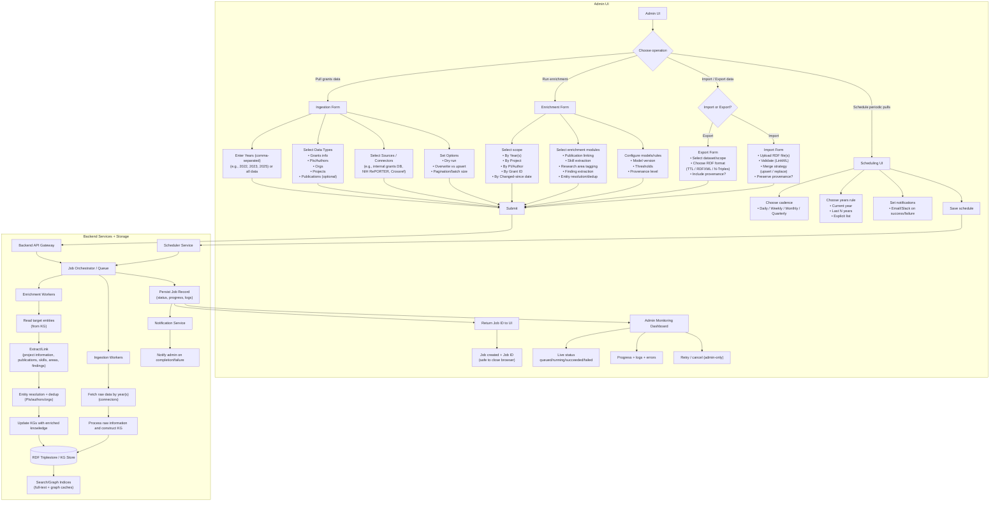

# Construction of Enriched Research Knowledge Graphs and an Interactive User Interface for Project Grants and Research Findings

## Overview 
This document builds on ongoing discussions in Slack and consolidates ideas, requirements, and early explorations related to research knowledge graph construction and user interface design. Its purpose is to provide a unified and concrete design reference that connects these discussions with an evolving implementation.

The screenshots included in this document reflect early explorations of knowledge graph structure, enrichment pipelines, and user interaction patterns. These artifacts ground the design in practical progress and serve as shared reference points for feedback and iteration.

The figures (from @tekrajchhetri and @Sulstice) below illustrate components of the current proof-of-concept (PoC), including project- and PI-centered views, skill representations, summary statistics, and related explorations across systems. Together, they demonstrate early capabilities and help contextualize the design decisions discussed in this document.

By bringing together concepts discussed across channels, PoC artifacts, and related efforts, this document aims to align define scope, tasks and connect parallel work streams. 

## Use Cases

The following use cases illustrate scenarios where this system provides value.

1. **Understand Funding Landscape and Expertise**  
   *As a program manager,* I want to explore funding information across projects and investigators so that I can understand who has received funding, what skills and research areas are being supported, and how funded work connects to outcomes.

2. **Discover People and Skills Behind Funded Research**  
   *As a researcher or PI,* I want to find people working in specific funded areas and understand their skills, projects, and publications so that I can identify potential collaborators and align my work with existing efforts.

3. **Assess Impact and Identify Strategic Opportunities**  
   *As a research leader,* I want to connect funding, people, skills, and findings in one place so that I can evaluate research impact, identify gaps or overlaps, and make informed strategic decisions.

## Goals

The goals of this work are to:

1. **Construct enriched research knowledge graphs** capturing project funding, principal investigators (PIs), and projects, and automatically enrich them with related information such as publications, publication-derived findings, skills, and research areas.

2. **Build and extend an interactive user interface** that supports user interactions for searching, browsing, and navigating the knowledge graphs to discover related and connected information.

3. **Integrate and align with existing cross-project efforts**, including BICAN, BBQS, and Connects. The intent is not to duplicate existing work, but to reuse, connect, and extend shared data, infrastructure, and capabilities across these projects where appropriate.

**Estimated deadline for completion: June, 30 2026.**

## Requirements

The following requirements guide the design and implementation of the system.

1. The Knowledge Graphs (KGs) must be backed by a clearly defined, and machine-readable ontology or schema that formally specifies core entities, relationships, and constraints, ensuring interoperability, validation, and long-term maintainability.
2. Provenance should be treated as a first-class citizen and **W3C PROV-O (PROV ontology)** should be reused.
3. Grant data must be downloaded, transformed into KGs and stored locally, and all API queries and operations must use this locally stored enriched KG as the primary data source.
4. The system should provide capabilities to perform automated knowledge graph enrichment using AI agents, enabling extraction, linking, and augmentation of entities and relationships from external and unstructured sources, e.g., publications.
4. The KGs are stored in graph database, such as Oxigraph.
4. The API must support asynchronous execution for long-running and resource-intensive operations (e.g., KG ingestion and enrichment), enabling background processing with job tracking independent of client session state.
5. The implementation must check for existing data (e.g., project records) before retrieving new information, ensuring deduplication and avoiding unnecessary re-fetching or duplication of data, e.g., grant and publication informations.
6. The system must provide search features allowing one to search skills, projects PIs, and Co-PIs.
6.  The user interface (UI) must support intuitive, CivicDB-style navigation, enabling users to start from any entity (e.g., a project) and seamlessly explore all directly linked and related information through interactive relationships.

---

## Admin Data Flow

```mermaid
---
config:
  theme: mc
---
flowchart TB
 subgraph UI["Admin UI"]
        B{"Choose operation"}
        A["Admin UI"]
        C["Ingestion Form"]
        C1["Enter Years (comma-separated)\n(e.g., 2022, 2023, 2025) or all data"]
        C2["Select Data Types\n• Grants info\n• PIs/Authors\n• Orgs\n• Projects\n• Publications (optional)"]
        C3["Select Sources / Connectors\n(e.g., internal grants DB, NIH RePORTER, Crossref)"]
        C4["Set Options\n• Dry run\n• Overwrite vs upsert\n• Pagination/batch size"]
        D["Submit"]
        E["Enrichment Form"]
        E1["Select scope\n• By Year(s)\n• By Project\n• By PI/Author\n• By Grant ID\n• By Changed-since date"]
        E2["Select enrichment modules\n• Publication linking\n• Skill extraction\n• Research area tagging\n• Finding extraction\n• Entity resolution/dedup"]
        E3["Configure models/rules\n• Model version\n• Thresholds\n• Provenance level"]
        S["Scheduling UI"]
        S1["Choose cadence\n• Daily / Weekly / Monthly / Quarterly"]
        S2["Choose years rule\n• Current year\n• Last N years\n• Explicit list"]
        S4["Set notifications\n• Email/Slack on success/failure"]
        S5["Save schedule"]
        X{"Import or Export?"}
        X1["Export Form\n• Select dataset/scope\n• Choose RDF format\n(TTL / RDFXML / N-Triples)\n• Include provenance?"]
        X2["Import Form\n• Upload RDF file(s)\n• Validate (LinkML)\n• Merge strategy\n(upsert / replace)\n• Preserve provenance?"]
        UI1["Job created + Job ID\n(safe to close browser)"]
        I["Return Job ID to UI"]
        M1["Live status\nqueued/running/succeeded/failed"]
        M["Admin Monitoring Dashboard"]
        M2["Progress + logs + errors"]
        M3["Retry / cancel (admin-only)"]
  end
 subgraph BE["Backend Services + Storage"]
        F["Backend API Gateway"]
        G["Job Orchestrator / Queue"]
        H["Persist Job Record\n(status, progress, logs)"]
        J["Scheduler Service"]
        W1["Ingestion Workers"]
        W2["Enrichment Workers"]
        P1["Fetch raw data by year(s)\n(connectors)"]
        P2["Process raw information and construct KG"]
        KG[("RDF Triplestore / KG Store")]
        Q1["Read target entities\n(from KG)"]
        Q2["Extract/Link\n(project information, publications, skills, areas, findings)"]
        Q3["Entity resolution + dedup\n(PIs/authors/orgs)"]
        Q4["Update KGs with enriched knowledge"]
        IDX["Search/Graph Indices\n(full-text + graph caches)"]
        N["Notification Service"]
        N1["Notify admin on completion/failure"]
  end
    A --> B
    B -- Pull grants data --> C
    C --> C1 & C2 & C3 & C4
    C1 --> D
    C2 --> D
    C3 --> D
    C4 --> D
    B -- Run enrichment --> E
    E --> E1 & E2 & E3
    E1 --> D
    E2 --> D
    E3 --> D
    B -- Schedule periodic pulls --> S
    S --> S1 & S2 & S4 & S5
    B -- Import / Export data --> X
    X -- Export --> X1
    X -- Import --> X2
    X1 --> D
    X2 --> D
    I --> UI1
    M --> M1 & M2 & M3
    D --> F
    F --> G
    G --> H & W1 & W2
    H --> I & M & N
    S5 --> J
    J --> G
    W1 --> P1
    P1 --> P2
    W2 --> Q1
    Q1 --> Q2
    Q2 --> Q3
    Q3 --> Q4
    Q4 --> KG
    KG --> IDX
    N --> N1
    P2 --> KG
```

### References
[1] Xu, J., Yu, C., Xu, J. et al. PubMed knowledge graph 2.0: Connecting papers, patents, and clinical trials in biomedical science. Sci Data 12, 1018 (2025). https://doi.org/10.1038/s41597-025-05343-8
[2] Xu, J., Kim, S., Song, M. et al. Building a PubMed knowledge graph. Sci Data 7, 205 (2020). https://doi.org/10.1038/s41597-020-0543-2