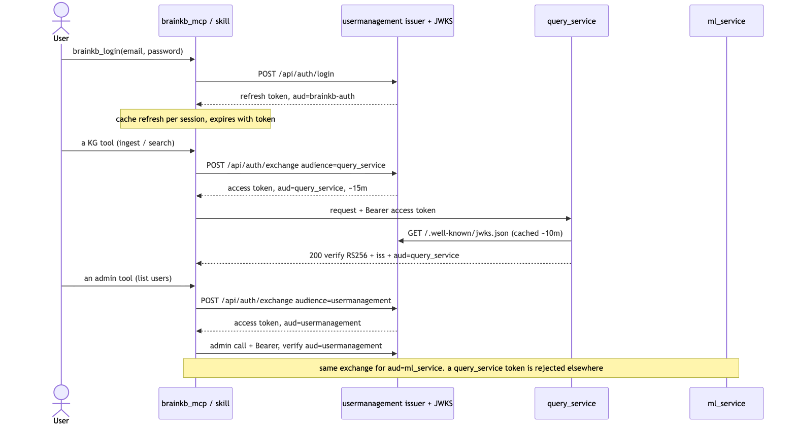
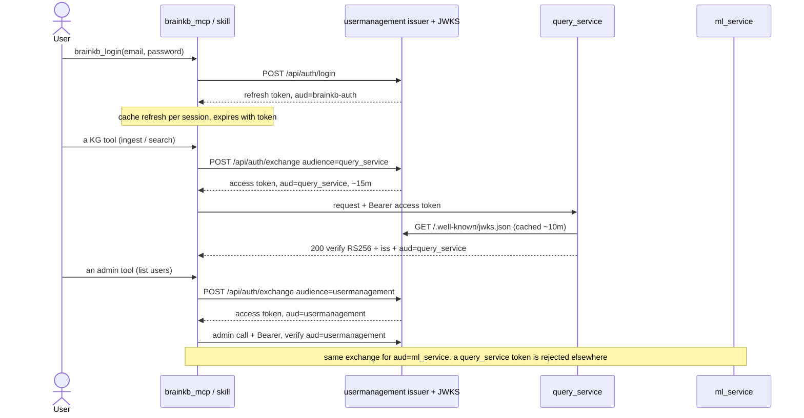
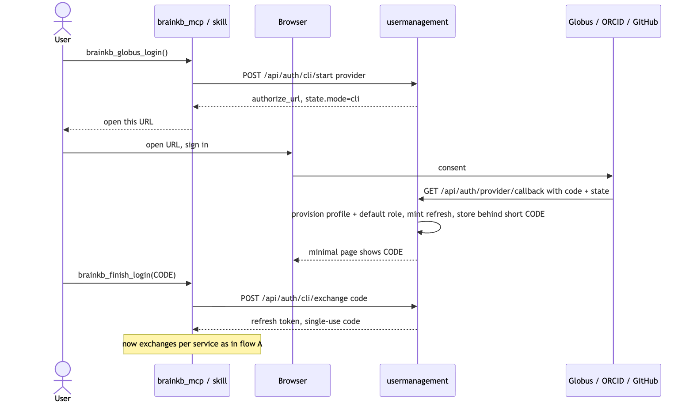
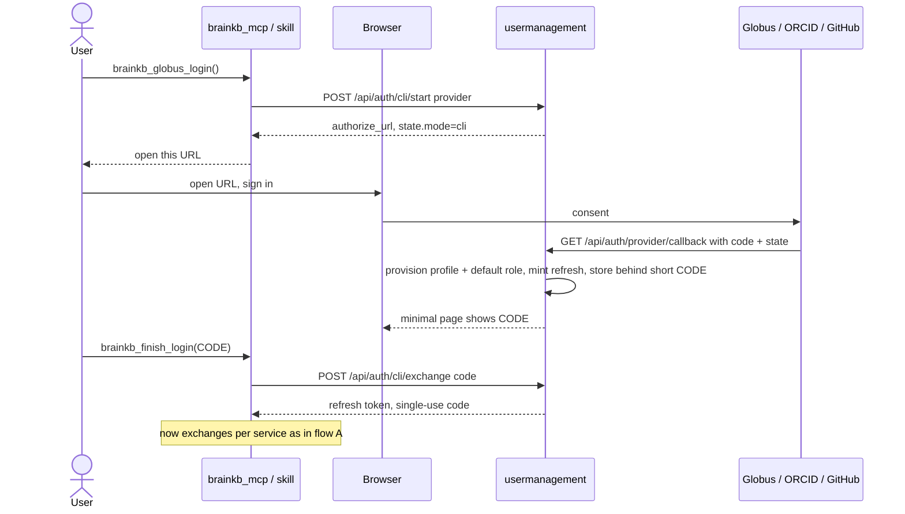
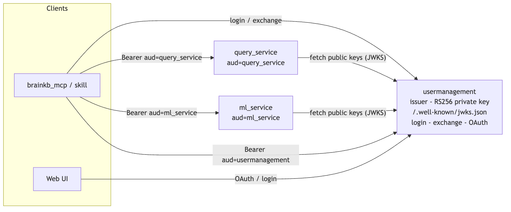
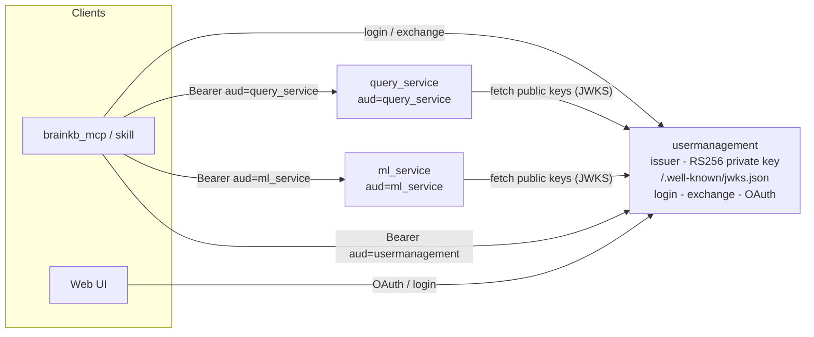

# BrainKB Authentication & Identity — Unification Design

Status: **Phase 1 + Phase 2 implemented & verified** (branch `auth-unification`).
Single-issuer RS256 + JWKS SSO with per-audience tokens is live-verified for
`query_service`, `usermanagement_service` (its own routes), and `ml_service`; the
`brainkb_mcp` is migrated to single sign-on. Legacy HS256 tokens still validate
during migration. `chat_service` deferred (not in use). The only step not
exercisable in the dev sandbox is the actual Globus browser consent.

Several further decisions were taken **during** implementation — onboarding via
OAuth (no self-registration), `/api/token` → `/api/login`, role/group-level
capability grants, SuperAdmin-over-Admin, ban-not-delete, OAuth login via the
skill (paste-code), and expiring sessions. Each is recorded with its problem and
rationale in **§9. Implementation decisions log**.
Audience: BrainKB maintainers
Scope: `query_service`, `usermanagement_service`, `APItokenmanager` (Django), and downstream services (`ml_service`, `chat_service`, `brainkb_mcp`).

---

## 0. Current authentication flow (as implemented)

usermanagement is the **single issuer**. One login mints a short-lived **refresh
token**; clients **exchange** it for narrow, per-service **access tokens**
(`aud=<service>`). Each service verifies against the issuer's **JWKS** and requires
its own audience, so a token minted for one service can't be replayed against
another (containment via `aud`, not shared secrets). Legacy HS256 per-service
tokens still validate during migration.

### A. Password / SSO login + per-service calls (via the MCP)

Diagram source (Mermaid)

### B. OAuth login via the skill (Globus / ORCID / GitHub — paste-code)

The browser consent is unavoidable (only the user can approve at the provider),
but the result is picked up out-of-band — no web UI needed.

Diagram source (Mermaid)

### C. Trust / containment overview

Diagram source (Mermaid)

Sessions are **not forever**: a cached login lasts until its refresh token expires
(`USERMANAGEMENT_REFRESH_TOKEN_TTL_MIN`, default 12h; MCP additionally caps via
`MCP_SESSION_TTL_MIN`). On expiry the MCP forgets the credentials and prompts a new
login.

---

## 1. Problem statement

BrainKB today authenticates users through **two overlapping systems**:

1. **JWT / scope system** — credentials in `Web_jwtuser` (email, password, `is_active`,
   `read`/`write`/`admin` scopes). Tokens are issued/validated by `query_service`
   (`/api/token`) and the user/scope records are administered by the Django
   `APItokenmanager`. This layer answers **"can this client call this API?"**

2. **Web / RBAC system** — identity in `Web_user_profile` +
   `Web_oauth_identity` (Globus / ORCID / GitHub), with authorization in
   `Web_user_role`. Tokens are issued by `usermanagement_service`
   (`create_access_token_v2`, roles embedded) and OAuth auto-provisions users.
   This layer answers **"who is this person and what are they allowed to do?"**

Both live in the **same Postgres database** and are **joined by email**
(`query_service` RBAC already reads roles from the profile side by email). So this
is not two isolated silos — it is **one user split across two tables**:
`Web_jwtuser` (credentials) vs `Web_user_profile` (identity + roles).

That split is the real source of the inconsistencies observed in practice:

| Symptom | Cause |
|---|---|
| OAuth user cannot password-login to `query_service` | OAuth path creates a `Web_jwtuser` shell with a random password |
| Password `Web_jwtuser` has no roles → treated as public/no-role | No matching `Web_user_profile` row |
| Two token shapes | `query_service` token = scopes only; `v2` token = roles + scopes + profile |
| MCP must log in twice | One login for `query_service`, another for `usermanagement` |
| "Where do I add a user?" is ambiguous | Two admin surfaces (Django token-manager vs usermanagement) |

---

## 2. Design principles (constraints we must respect)

- **P1 — Preserve per-service token containment.** Per-service tokens were a
  deliberate security decision: a token leaked from one service must not be
  replayable against another. Any unification **must not** regress to a single
  shared bearer token that works everywhere.
- **P2 — One identity, one authorization source.** "Who is this user and what can
  they do" must be answerable exactly one way, from one source of truth.
- **P3 — OAuth is the primary onboarding path.** Globus/ORCID/GitHub provisioning
  already exists and is where new users come from; password login remains a
  supported credential, not a separate user universe.
- **P4 — Incremental, reversible migration.** No flag-day cutover; each phase must
  be shippable and independently valuable.

---

## 3. Key insight: separate the two decisions

"Merge the auth systems" conflates two independent choices. Treat them separately:

- **Decision A — Identity model.** One canonical user vs. the current
  `jwtuser`-shell + `profile` split.
- **Decision B — Token issuance.** How many issuers, what token shape, and how
  cross-service replay is prevented.

Merging identity (A) is high-value and low-risk. Collapsing tokens (B) is where the
security tradeoff lives and must be chosen deliberately.

---

## 4. Recommendation

### 4.1 Decision A — Unify the identity model (do this)

Converge on **one canonical user**, the profile, keyed by email:

- `Web_user_profile` is the **single user record**. Credentials, OAuth identities,
  roles, and API scopes all hang off it.
- `Web_jwtuser` is **demoted to a 1:1 credential record** for a profile (or removed
  entirely, with password hash + `is_active` folded into the profile). It is no
  longer a parallel "user."
- Every service resolves **identity + roles + scopes from this single source**
  (`query_service` already reads roles by email — this generalizes that pattern).
- OAuth provisioning stops creating a "shell" user; it creates/links **the** profile.
  A password can be set on the same profile later, so OAuth and password login
  address the same identity.

**Outcome:** the four-row table of symptoms in §1 disappears. There is one user,
one place roles/scopes live, one answer to "who is this."

### 4.2 Decision B — Token strategy (choose one, deliberately)

**Option B1 — Unified identity, per-service tokens (recommended first step).**
Keep each service issuing and validating its **own** token (own secret). The token
stays a thin proof-of-identity; **roles/scopes are read from the unified identity
source**, not trusted from a cross-service token. This fully preserves P1
(containment) and requires no JWKS/audience machinery. It is the smallest change
that removes the identity fragmentation.

**Option B2 — Single issuer + audience-scoped tokens (proper SSO; later).**
Make `usermanagement_service` the **auth authority** (it already issues role-bearing
v2 tokens and owns OAuth). Publish signing keys via **JWKS**; stamp every token with
an **`aud` (audience)** claim; each service accepts **only** tokens minted for its
own audience. This gives *one login* while still preventing cross-service replay —
containment is enforced by `aud` validation instead of separate secrets. This is the
clean long-term target but is a real project: JWKS rollout, `aud` enforcement in
every service, and token/user migration.

**Do not** merge into a single shared-secret token that works everywhere — it
violates P1.

### 4.3 Direction of travel

`usermanagement_service` is the newer, richer identity service (OAuth + roles + v2
tokens) and should become the **identity/auth authority**. The Django
`APItokenmanager`'s separate `jwtuser` notion is the **legacy piece to fold in**,
not the foundation to build on.

---

## 5. Phased migration plan

### Phase 0 — Freeze the contract (no behavior change)
- Document the canonical claims a BrainKB token carries: `sub` (email/profile id),
  `roles`, `scopes`, `iss`, `exp`, and (reserved for Phase 2) `aud`.
- Confirm every service reads roles/scopes from the shared source, not only from the
  token, so tokens can shrink safely later.

### Phase 1 — Unify identity (Decision A + Option B1)
1. Make `Web_user_profile` the single user; ensure every `Web_jwtuser` has a matching
   profile (backfill by email) and every profile can hold a password + `is_active`.
2. Repoint OAuth provisioning to create/link the profile (no shell user).
3. Repoint `query_service` login and RBAC to the unified record; keep its own token
   issuance/validation (containment preserved).
4. Update `brainkb_mcp` + `brainkb_skills`: one login concept, one identity; the MCP
   still obtains a per-service token where it calls each service, but from **one**
   set of user credentials.
5. Migration safety: keep `Web_jwtuser` readable during transition; dual-read, then
   deprecate.

**Ship here.** This resolves the reported inconsistencies. Stop unless SSO is wanted.

#### Phase 1 — what was actually implemented (branch `auth-unification`)

Decision A (unify identity) + Decision B Option B1 (per-service tokens), verified
live against the running stack:

- **Explicit credential→profile link.** Added `Web_jwtuser.profile_id`
  (FK → `Web_user_profile.id`, `ON DELETE SET NULL`, indexed) to the ORM model
  and as an idempotent inline migration in `usermanagement bootstrap`, plus a
  **case-insensitive email backfill** for pre-existing rows. The credential row
  is now a 1:1 record for the canonical profile, not an email-only sibling.
  *(Verified: migration applied cleanly; 2/3 existing credentials backfilled.)*
- **Single provisioning path.** New `provision_identity(...)` in
  `usermanagement/core/database.py` is the one place that ensures
  profile + linked credential + default role (`Curator`) + bootstrap-superadmin
  elevation. Idempotent; caller owns the transaction.
- **OAuth callback refactored** onto `provision_identity` — removed the ad-hoc
  `_ensure_jwt_user_shell` + default-role + bootstrap duplication; OAuth now
  sets `profile_id`. *(Verified: usermanagement boots clean, `/api/token` OK.)*
- **Password registration now provisions identity.** `query_service /api/register`
  ensures a canonical profile, assigns the default role, and links the
  credential (`_provision_profile_for_registration`, best-effort so it never
  blocks account creation). This fixes the "password user has no roles" symptom.
  *(Verified: fresh register → profile + `profile_id` link + `Curator` role.)*
- **Standardized token claims.** `query_service` tokens now carry
  `sub`/`scopes`/`user_id`/`profile_id`/`roles`/`auth_source` — identical in
  shape to usermanagement's v2 token — while still signed with query_service's
  **own** secret (containment preserved). Roles remain informational;
  authorization keeps re-reading roles from the DB via `core.rbac`.
  *(Verified: both services' `/api/token` return the same claim shape; existing
  protected endpoints still authorize.)*

Not in Phase 1 (unchanged, deliberate): per-service secrets/token isolation;
`require_admin` still trusts the token `roles` claim in usermanagement (noted for
Phase 2); no shared issuer / JWKS / `aud`.

### Phase 2 — Optional single-issuer SSO (Decision B → Option B2)
1. `usermanagement_service` becomes the sole issuer; expose **JWKS**.
2. Add `aud` to tokens; enforce per-service audience validation everywhere
   (`query_service`, `ml_service`, `chat_service`, MCP targets).
3. Migrate services from local secret validation to JWKS + `aud`.
4. Retire per-service `/api/token` login endpoints in favor of the central one;
   `APItokenmanager`'s user store is fully folded in.

#### Phase 2 — what was actually implemented (branch `auth-unification`)

Single-issuer, per-audience SSO with containment preserved via `aud` (Decision B
Option B2). Additive: legacy HS256 tokens keep working, so this is a safe
migration, not a flag-day cutover.

- **usermanagement is the issuer (RS256 + JWKS).** New `core/tokens_rs256.py`:
  loads an RS256 private key from `USERMANAGEMENT_JWT_PRIVATE_KEY_PEM`/`_FILE`,
  or generates a **process-shared** ephemeral key persisted to a file (so all
  uvicorn workers agree — a per-worker ephemeral key breaks cross-worker
  verification). Publishes `GET /.well-known/jwks.json`.
- **Login → refresh → exchange.** New `core/routers/sso.py`:
  `POST /api/auth/login` (`{email,password}`) returns a short-lived **refresh
  token** (`aud=brainkb-auth`, not accepted by any service);
  `POST /api/auth/exchange` (Bearer refresh, `{audience}`) returns a narrow
  **access token** for a single service (`aud=<service>`). Roles/scopes are
  **re-read fresh from the DB at exchange time**, so a stale refresh token can't
  carry stale authorization; active-credential + ban checks run here too.
- **query_service verifies via JWKS + `aud`.** New `core/jwks.py` (sync, so the
  sync `require_scopes` dependency can use it): fetches + caches the JWKS,
  verifies RS256, and **requires `aud == query_service`** and the configured
  issuer. A new `decode_token_any()` tries RS256 (SSO) first, then falls back to
  legacy HS256; it is wired into `get_current_user`, `get_current_user_optional`,
  `verify_scopes`/`require_scopes`, and the websocket auth path.
- **Containment preserved.** Tokens are audience-scoped: a `query_service` token
  cannot be replayed against `ml_service`. Enforcement is by `aud` validation,
  not shared secrets — query_service keeps its own HS256 secret for legacy
  tokens and never learns the issuer's private key.

Deployment env (set before/at the fresh deploy):

- usermanagement: `USERMANAGEMENT_JWT_PRIVATE_KEY_PEM` **or** `_FILE` — normally
  **not needed**: the unified container's `start.sh` auto-generates a persistent
  RS256 key at `/app/secrets/um_jwt_private.pem` (mounted from `./secrets`) on
  first boot, giving a stable `kid` across the 4 gunicorn workers and redeploys.
  Set `_PEM`/`_FILE` only to supply your own key. (If key generation is somehow
  unavailable, the service falls back to a shared ephemeral key and logs a
  warning.) Plus `USERMANAGEMENT_JWT_ISSUER` (default `brainkb-usermanagement`),
  `USERMANAGEMENT_ACCESS_TOKEN_TTL_MIN` (15), `USERMANAGEMENT_REFRESH_TOKEN_TTL_MIN`
  (720), `USERMANAGEMENT_TOKEN_AUDIENCES` (`query_service,ml_service,chat_service`).
  Web sign-in uses its own pair: `USERMANAGEMENT_WEB_SESSION_TTL_MIN` (720 — the
  access JWT the UI gets as `?token=`) and `USERMANAGEMENT_WEB_REFRESH_TTL_MIN`
  (10080 — the `?refresh=` token the UI exchanges for silent renew), so the overall
  web session lasts 7 days without re-login.
- query_service: `QUERY_SERVICE_SSO_JWKS_URL` (default
  `http://127.0.0.1:8004/.well-known/jwks.json`; in a split deployment point at
  the usermanagement service URL), `QUERY_SERVICE_SSO_ISSUER` (must match the
  issuer), `QUERY_SERVICE_SSO_AUDIENCE` (`query_service`).

Verified before deploy: JWKS endpoint serves a key; `/api/auth/login` returns a
refresh token; RS256→JWK verification roundtrip validates `aud`+`iss`; jose
accepts JWK dicts. Full login→exchange→query_service acceptance, wrong-`aud`
rejection, and legacy-HS256 coexistence to be confirmed on the fresh deployment.

Phase 2 rollout — services now verifying RS256 (aud-scoped, JWKS):
- **query_service** (`aud=query_service`) — verified live.
- **usermanagement** (`aud=usermanagement`) — its own protected routes now
  accept SSO tokens via `verify_token` (local public-key verify, since it is the
  issuer); `usermanagement` added to the exchangeable audiences. Verified live:
  usermanagement-aud → 200, query_service-aud → 401, legacy v2 → 200.
- **ml_service** (`aud=ml_service`) — `core/jwks.py` verifier + `decode_token_any`
  wired into `get_current_user`, `verify_scopes`/`require_scopes`, `decode_jwt`
  (covers SSE), and the websocket path. Verified live: ml-aud → 200,
  query_service-aud → 401, legacy HS256 → 200.

- **brainkb_mcp** — migrated to single sign-on: `brainkb_login` mints a refresh
  token (cached per session) that the MCP exchanges on demand for per-service
  access tokens (`query_service`, `usermanagement`). One login now covers both KG
  and admin tools — the old two-login logic is gone. Legacy `/api/token` remains
  an automatic fallback. A header caller can pass a refresh token to unlock all
  services. Verified live: login → exchange(query_service|usermanagement) → both
  services accept their token; a query_service token is rejected at usermanagement.

Remaining Phase 2 rollout (not yet done):
- **chat_service**: same `core/jwks.py` pattern (using `requests`, no httpx) —
  deferred; service not currently in use.
- Once clients have migrated, retire the legacy HS256 `/api/token` paths and
  fold in `APItokenmanager`; tighten `require_admin` to re-read roles from the DB.

---

## 6. `brainkb_mcp` — how it authenticates (implemented)

The MCP is migrated to single sign-on (see the diagrams in §0). Summary of the
implemented behavior:

- **One login, per-service exchange.** `brainkb_login(email, password)` mints a
  refresh token cached for the session; `_token_for(audience)` exchanges it on
  demand for a `query_service` or `usermanagement` access token. The old
  two-login model (`_um_login` / separate `_UM_TOKENS`) is gone — one login now
  covers both KG and admin tools.
- **OAuth via the skill** (Globus/ORCID/GitHub): `brainkb_globus_login()` →
  authorize URL → user signs in → browser shows a short code →
  `brainkb_finish_login(code)` (backend `/api/auth/cli/start` + `/cli/exchange`,
  flow B in §0). No web UI required.
- **Personal Access Token (browser-free, recommended).** Set `BRAINKB_TOKEN` to a
  `brainkb_pat_…` (minted once via `brainkb_create_token`) — `_token_for` recognizes
  the prefix and exchanges it at `/api/auth/pat/exchange` per service, no login or
  browser afterward. `brainkb_use_token(pat)` does the same for one session.
  Manage with `brainkb_list_tokens` / `brainkb_revoke_token`. See §9.11.
- **Header pass-through (stateless, multi-user remote):** a caller may send
  `Authorization: Bearer <token>`. A **refresh** token or a **PAT** unlocks all
  services (the MCP exchanges it per service); a single **service access token**
  is used as-is.
- **Sessions expire.** The cached session lasts until its refresh token expires
  (`USERMANAGEMENT_REFRESH_TOKEN_TTL_MIN`), hard-capped by `MCP_SESSION_TTL_MIN`.
  On lapse the MCP forgets the credentials and asks the user to log in again;
  `brainkb_whoami` reports `session_expires_in_min`.
- **Legacy fallback.** If the backend has no SSO, the MCP falls back to the
  per-service `/api/token` login automatically, so it keeps working during
  migration.
- **Abuse protection.** Per-caller (source-IP) rate limiting; login/register are
  the strict `auth` bucket. See `brainkb_mcp/README.md`.

---

## 7. Risks & mitigations

| Risk | Mitigation |
|---|---|
| User/token migration errors | Backfill by email; dual-read `jwtuser`↔`profile` before deprecating |
| Losing containment (P1) | Phase 1 keeps per-service tokens; Phase 2 uses `aud`, not shared secrets |
| Multi-service coordination | Phase 2 only; roll out JWKS+`aud` service by service behind a validation shim |
| OAuth vs password ambiguity | Single profile owns both; password becomes an attribute of the identity |
| Downstream breakage (`ml_service`, `chat_service`) | Phase 0 makes services read roles from source, so token shape can change safely |

---

## 8. Recommendation summary

- **Do now:** unify the **identity model** (§4.1) with **per-service tokens**
  (§4.2 Option B1). High value, preserves containment, small blast radius.
- **Do later, deliberately:** single-issuer **audience-scoped SSO** (§4.2 Option B2)
  when ready to operate JWKS + `aud` properly.
- **Do not:** collapse to one shared-secret token usable across all services.

---

## 9. Implementation decisions log (problems → decisions)

Decisions taken while building Phases 1–2. Each: the problem, the decision, and
where it lives. All are live-verified except the Globus browser consent (dev
sandbox has no browser); the mechanics around it are verified.

### 9.1 Onboarding: no self-registration — OAuth first-login creates the user
- **Problem.** Two onboarding paths existed: a password `/api/register` (created a
  `Web_jwtuser`, initially role-less / inactive, needing admin activation) *and*
  OAuth. The password path produced role-less "orphan" accounts and an extra
  activation step, and duplicated identity creation.
- **Decision.** A user is created **only** on first Globus/ORCID/GitHub login,
  which auto-provisions + links the profile and assigns a default role
  (`provision_identity`). Self-registration is **disabled**: `/api/register` →
  `405` on `query_service` and `ml_service`; the MCP `brainkb_register` tool was
  removed.
- **Trade-off.** No API path to create a *password* account anymore (Globus is the
  identity source). Existing/seeded password accounts still log in.

### 9.2 Endpoint naming: `/api/token` → `/api/login`
- **Problem.** "token" was ambiguous next to the SSO refresh/exchange tokens, and
  read as an issuance detail rather than "log in".
- **Decision.** Password login is **`/api/login`** on `query_service`,
  `usermanagement`, `ml_service`; **`/api/token` kept as a hidden deprecated
  alias** (same handler) so existing clients don't break. MCP prefers `/api/login`
  and falls back to `/api/token`.

### 9.3 Authorization: grant capabilities to a whole group/role
- **Problem.** Capabilities could be granted per-**user** (`user_capability_grants`)
  or scoped to a space (access rules), but a **custom group/role** (e.g.
  `uk_collaborator`) could only ever get the hardcoded `read_private` — no way to
  give a whole group `ingest`/`create_private_space`, etc.
- **Decision.** New `role_capability_grants` table + `grant/revoke_role_capability`
  and `/admin/capabilities/grant-role|revoke-role|role|available` endpoints.
  Effective caps = role-derived ∪ **role/group grants** ∪ per-user grants. Only the
  delegatable set is grantable (`grant`/`sparql_admin` stay admin-intrinsic — no
  escalation). Also: a **space write access rule now GRANTS ingest** to a group
  (previously rules could only restrict).

### 9.4 Admin hierarchy: SuperAdmin-over-Admin (and who creates whom)
- **Problem.** Any Admin could assign/remove the `Admin` role on, or ban, another
  Admin — no real hierarchy; a peer/rogue Admin could lock others out.
- **Decision.** Assigning/removing the `Admin` (or `SuperAdmin`) role and banning
  an Admin are **SuperAdmin-only**. `SuperAdmin` stays bootstrap-seeded and
  protected (never removable/bannable). Regular Admins manage non-admin users.
- **Who creates whom.** **SuperAdmin** is bootstrapped at deployment via
  `USERMANAGEMENT_BOOTSTRAP_SUPERADMIN_EMAILS` (seeded on first login) and can grant
  `SuperAdmin`/`Admin` to others. **Admin** is created by a SuperAdmin assigning the
  `Admin` role. Admin and SuperAdmin have the same KG capabilities; the difference
  is that SuperAdmin is the protected, admin-managing tier.

### 9.4a `manage_team_space` is scoped, not blanket
- **Problem.** A `manage_team_space` holder could manage **every** team space —
  effectively a platform-wide admin power leaking through a delegatable capability.
- **Decision.** A non-admin manages a team space **only** if they **own** it
  (created it), are matched by a per-space `manage` access rule, or hold
  `manage_team_space` **and are a member of that space** — i.e. only spaces they
  created or were assigned to. **Admin/SuperAdmin** still manage all. (query_service
  `_can_manage`.) Verified: non-member holder → 403; owner/member-holder/admin → OK.

### 9.5 Removal: ban, never hard-delete
- **Problem.** Hard-deleting a user destroys provenance/audit history and is
  irreversible.
- **Decision.** **We don't delete.** `DELETE /api/admin/users/{id}` → `405`;
  removal is a reversible **ban** (`/ban` + `DELETE /ban` to lift), which preserves
  history. `deactivate` toggles login access.

### 9.6 OAuth login through the skill (paste-code)
- **Problem.** OAuth needs a browser consent the MCP can't perform, and the normal
  callback redirects to the **web UI** — so "Globus login via skill" seemed to
  require the website.
- **Decision.** An out-of-band **paste-code** flow: `POST /api/auth/cli/start`
  (state marked `cli`) → user signs in → the callback mints an SSO refresh token,
  stores it behind a short one-time **code**, and shows a minimal page (no SPA) →
  `POST /api/auth/cli/exchange {code}` returns the refresh token (single-use). MCP:
  `brainkb_globus_login` → `brainkb_finish_login(code)`.

### 9.7 Sessions expire (logins are not forever)
- **Problem.** The MCP cached credentials/refresh, so a login effectively lasted
  forever (a cached password could silently re-login).
- **Decision.** A cached session lives only until its **refresh token expires**
  (`USERMANAGEMENT_REFRESH_TOKEN_TTL_MIN`, default 12h), hard-capped by
  `MCP_SESSION_TTL_MIN`. On lapse the MCP forgets the credentials and prompts a new
  login; `brainkb_whoami` reports `session_expires_in_min`.

### 9.8 Operational decisions
- **SSO signing key** auto-provisioned at container start to `/app/secrets` (a
  persistent volume) so the JWKS `kid` is stable across the 4 gunicorn workers and
  redeploys — fixing a real multi-worker "MissingGreenlet"/per-worker-key failure
  found in testing. An explicit `USERMANAGEMENT_JWT_PRIVATE_KEY_PEM/_FILE` overrides.
- **Rate limiting** (per-caller, source-IP) in the MCP; `login`/OAuth-start use a
  strict bucket. Large **file** ingest is not byte-capped and uses no read/write
  timeout (raw-text ingest is capped) so ~5 GB TTL/JSON-LD uploads aren't aborted.

### 9.9 `require_admin` re-reads roles from the DB (done)
- **Problem.** `require_admin` trusted the token's `roles` claim, so a revoked/
  demoted admin kept access until their token expired.
- **Decision.** `require_admin` (and the `_is_superadmin` gate on admin-tier
  actions) now re-read **active roles from the DB** (`_current_roles_from_db` by
  profile_id/email); the bootstrap-superadmin allowlist is still honored for first
  sign-in. Verified: an old token claiming `roles=[Admin]` is accepted while the
  role exists, and rejected (403) the moment the role is removed in the DB.

### 9.10 Web UI migrated off the password service account (SSO session-exchange)
- **Problem.** The `brainkb-ui` audit showed user login is already OAuth-only, but
  ML/query calls used a shared **service-account password** on `/api/token`
  (`NEXT_PUBLIC_JWT_USER/PASSWORD`), and two NER routes took form-entered
  credentials. That was the last thing blocking password-login retirement.
- **Decision.** New `POST /api/auth/session-exchange` (usermanagement): swap an
  authenticated **session token** (the UI's usermanagement JWT) for a short-lived
  `aud=<service>` access token, **scopes derived from roles** (RBAC authoritative —
  removes the need for the Django scope manager). The UI now session-exchanges for
  `ml_service`/`query_service` tokens; the service-account password is a deprecated
  fallback only. Verified backend-side (session token → aud token → 200 at
  query_service); the UI change needs deploy testing.

### 9.11 Personal Access Tokens (PATs) — browser-free CLI/MCP auth
- **Problem.** CLI/MCP auth required either a password login or a one-time Globus
  browser paste-code **every session** — and both mint an RS256 refresh token that
  depends on the SSO key material (the per-worker key-file we had to persist). Users
  wanted a "generate once, paste into the skill config, no browser afterward"
  credential.
- **Decision.** Add an **opaque, DB-backed Personal Access Token**. A user mints one
  while logged in (`POST /api/auth/tokens` → shown once as `brainkb_pat_…`), sets it
  as `BRAINKB_TOKEN` in the MCP config, and every call thereafter exchanges it at
  `POST /api/auth/pat/exchange` for the same short-lived `aud=<service>` access token
  the refresh flow issues. No browser/login after the one-time mint.
- **Why opaque (not a signed/long-lived JWT).** (1) **Instantly revocable** — a
  signed JWT lives until it expires; an opaque token is a DB row we flip. (2) **No
  key material exposed to the user** — they handle one string, never a key; this is
  exactly the "no RSA/key for CLI" ask. (3) **Roles re-read live** at exchange time,
  so a ban/demotion takes effect immediately. Only the SHA-256 hash is stored, so a
  DB leak yields no usable tokens.
- **Why services need no change.** The PAT is validated only at usermanagement; the
  token it *exchanges into* is the ordinary RS256 per-service token, so query/ml
  verify it via JWKS unchanged — containment (`aud`) preserved.
- **Model.** `Web_personal_access_token` (token_hash unique, prefix, name,
  profile_id, jwt_user_id, email, revoked, expires_at, last_used_at). Endpoints:
  create / list / revoke (session-auth) + `pat/exchange` (PAT-auth). Env:
  `USERMANAGEMENT_PAT_DEFAULT_DAYS` (**3** — short-lived by default; a user may
  still request up to the cap), `_MAX_DAYS` (365), `_MAX_PER_USER` (20).
- **MCP.** `BRAINKB_TOKEN` env + `brainkb_use_token` set a PAT; `_token_for`
  recognizes the `brainkb_pat_` prefix and PAT-exchanges (header, session, or env).
  Tools: `brainkb_create_token`, `brainkb_list_tokens`, `brainkb_revoke_token`.
- **Verified live** (unified container): create → list → exchange → **200** at
  query_service → revoke → exchange **401** (instant revocation); exchange re-read
  roles fresh from the DB (`auth_source=pat`).
- **Note (signing scheme).** Considered switching the internal SSO tokens to an
  HS256 shared secret. **Decision: no change for now** — stay on RS256/JWKS (full
  reasoning in §9.12). The PAT is independent of this (opaque, DB-validated); it
  exchanges into whatever the issuer mints.

### 9.12 Why the SSO access tokens are RS256 (asymmetric) and not a shared HS256 secret
- **Question raised.** For a four-service deployment, wouldn't a single shared
  secret (HS256) be simpler than RSA — no JWKS, no public-key distribution, no
  per-worker key generation? (It would; the shared secret *is* the key. The
  question is what that simplicity costs.)
- **The core property RS256 buys: a verifier that cannot forge.**
  usermanagement is the **sole issuer**; query/ml/chat only **verify**.
  - **RS256 (what we use).** The issuer holds the **private** key (signs); every
    other service holds only the **public** key (published at
    `/.well-known/jwks.json`) and can *verify without holding any secret capable of
    minting*. If ml_service is compromised, the attacker gets a public key — they
    **still cannot mint tokens** for any service.
  - **HS256 (shared secret).** Signing and verifying use the **same** secret. Every
    service that verifies must hold a secret that can equally **forge**. Compromise
    of *any one* service (or a leaked env/log) lets the attacker mint tokens for
    **all** services with arbitrary `sub`/`roles`/`scopes`/`aud`. The other services
    cannot distinguish the forgery from a genuine token.
- **Containment is the whole point of Phase 2.** Per-`aud` tokens give crypto-enforced
  containment: a token minted for `query_service` is provably unusable at
  `ml_service`. Under HS256 that containment degrades to *trust-based* — any
  secret-holder can set `aud` to anything — which undoes a property we deliberately
  built (see §4.2 / Phase 2).
- **Other HS256 costs (not removed, just relocated).** A shared secret still has to
  be distributed to every service, environment, and worker, and **rotated
  everywhere simultaneously**; its compromise radius is all four services at once.
  So HS256 removes *asymmetric-key* management but not *secret* management.
- **Why RSA's operational pain is acceptable.** The one real downside we hit was
  provisioning the private key across gunicorn workers (fixed by persisting one key
  to a shared file; production sets `USERMANAGEMENT_JWT_PRIVATE_KEY_PEM/_FILE`
  explicitly). That is a one-time deploy concern, not a per-request cost — RS256
  verification is local and stateless (no introspection call), same as HS256.
- **When we *would* switch.** If the four services ever collapse into a context where
  asymmetry provably buys nothing (and stays that way) *and* the key-provisioning
  overhead outweighs containment, HS256 is defensible — but only with: strict
  `algorithms=["HS256"]` (never let the JWT header pick the alg), enforced
  `iss`+`aud`, a ≥256-bit secret from a secret manager (not `.env` in Git), separate
  secrets per environment, and the internet-facing MCP holding **no** secret (it
  only relays, so it never becomes a forger). Until there's a concrete reason,
  RS256's "verifier ≠ issuer" property is worth its modest operational cost.
- **If reversing:** keep it a **config** switch, not a rewrite — retain RS256 verify
  paths so a future distributed/split deployment can re-enable asymmetric signing
  without new code.

### Still open (deliberately deferred)
- **Retire the legacy HS256 `/api/login`(`/token`) paths + fold in
  `APItokenmanager`.** Now unblocked for the web UI (migrated to session-exchange,
  §9.10) and the MCP (SSO). **Do after** confirming, on a real deploy, that the UI
  works via session-exchange — then: (1) restrict/remove password login (keep a
  SuperAdmin break-glass if wanted), (2) remove the `api_tokenmanager` Django
  program from `Dockerfile.unified` + change the container healthcheck off `:8000`
  + drop its start.sh migration steps (`Web_jwtuser`/`Web_scope` tables are created
  by usermanagement `create_all`).
- `chat_service` RS256 verification (same `core/jwks.py` pattern) — not in use.
