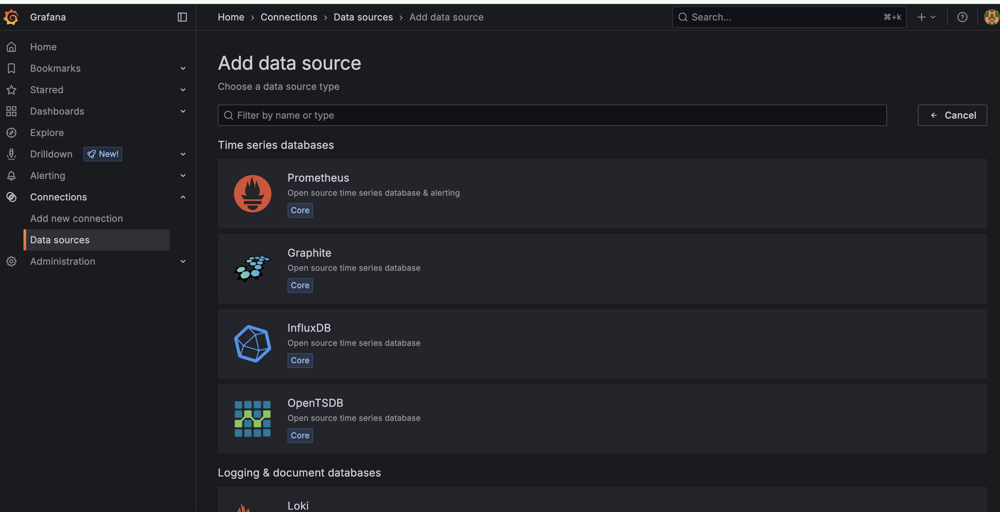
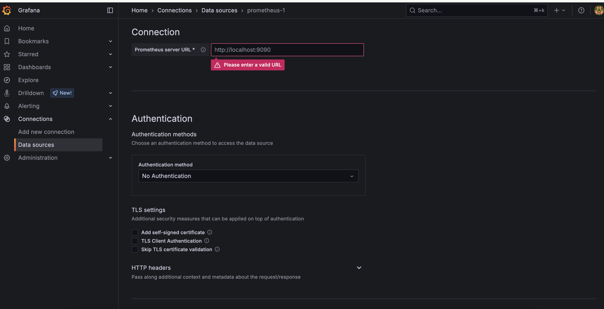
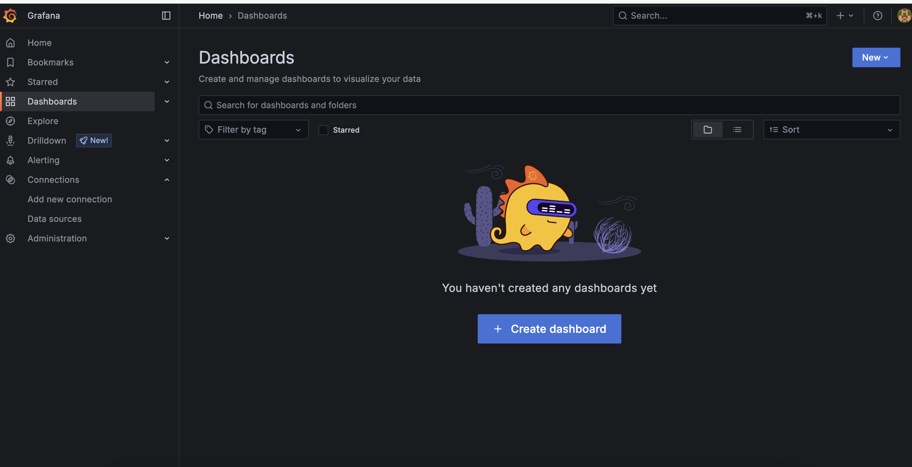
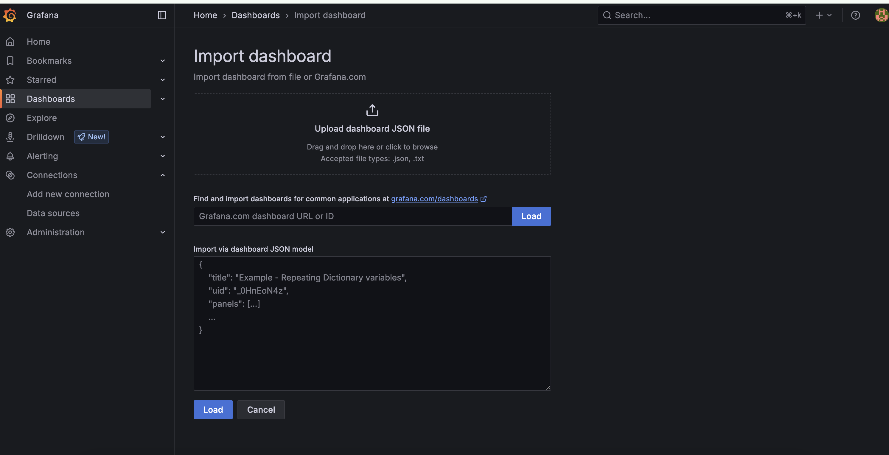
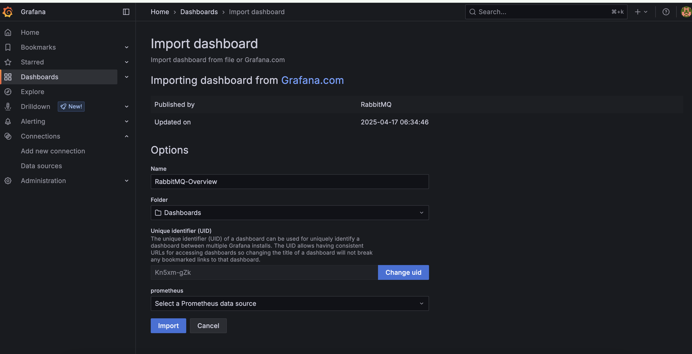
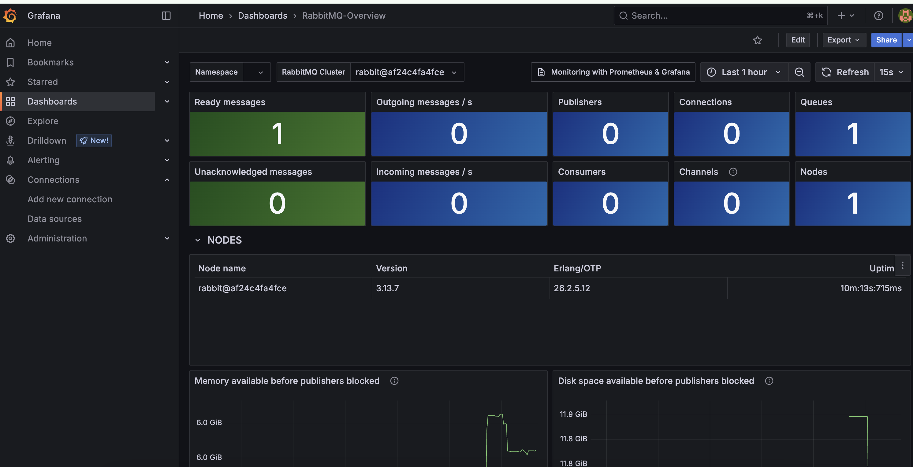

# 🚀 RabbitMQ Deployment with Prometheus & Grafana Monitoring

This repository provides a **Docker Compose setup for RabbitMQ** with custom configuration to support **large message sizes** (up to 1.5 GB), as well as integrated **Prometheus and Grafana monitoring**.

---

## 📦 Features

- RabbitMQ 3 with Management UI
- Custom RabbitMQ configuration:
  - `frame_max` increased to support large messages
  - `vm_memory_high_watermark` adjusted for better memory handling
  - Prometheus metrics endpoint enabled
- Prometheus for real-time metrics collection
- Grafana for visualizing RabbitMQ metrics
- Persistent volumes for RabbitMQ and Grafana

---

## 📁 File Structure

```
.
├── docker-compose-rabbitmq-monitoring.yml   # Docker Compose file
├── rabbitmq.conf                            # RabbitMQ configuration
├── prometheus.yml                           # Prometheus scrape config
├── .env                                     # Environment variables (user/password)
└── README.md
```

---

## ⚙️ Configuration Overview

### RabbitMQ (`rabbitmq.conf`)
```ini
frame_max = 1610612736
vm_memory_high_watermark.relative = 0.8
prometheus.tcp.port = 9419
loopback_users.guest = false
```

### Prometheus (`prometheus.yml`)
```yaml
scrape_configs:
  - job_name: 'rabbitmq'
    static_configs:
      - targets: ['rabbitmq:9419']
```

### Environment Variables (`.env`)
Copy the .env.example and update the change the username and password.
```env
RABBITMQ_DEFAULT_USER=admin
RABBITMQ_DEFAULT_PASS=securepassword123
GF_SECURITY_ADMIN_USER=admin
GF_SECURITY_ADMIN_PASSWORD=secure1234
```

---

## 🚀 Deployment Steps

1. **Clone this repository**

```bash
cd rabbit-mq
```

2. **Create and edit `.env` file**

```bash
cp .env.example .env
# Edit RABBITMQ_DEFAULT_USER and RABBITMQ_DEFAULT_PASS as needed
```

3. **Start all services**

```bash
docker-compose -f docker-compose-rabbitmq-monitoring.yml up -d
```

---

## 🌐 Access

- **RabbitMQ UI**: [http://localhost:15672](http://localhost:15672)
- **Prometheus**: [http://localhost:9090](http://localhost:9090)
- **Grafana**: [http://localhost:3000](http://localhost:3000)

---
## 📊 Configure Grafana UI to Monitor RabbitMQ

### 🔌 Step 1: Add Prometheus as a Data Source

1. Navigate to **Connections** → **Data Sources** → **Add data source** and select **Prometheus**.  
   

2. In the Prometheus configuration screen, set the **Prometheus server URL** to your server address (e.g., `http://localhost:9090`).  
   

---

### 📈 Step 2: Import RabbitMQ Monitoring Dashboard

Once your data source is connected, you can import a pre-built dashboard to monitor RabbitMQ.

1. Click on **Dashboards** from the left panel.  
   

2. Click on **New** → **Import**.  
   

3. In the **Import via grafana.com** section, enter dashboard ID: `10991` and click **Load**.

4. Select the configured **Prometheus** data source and click **Import**.  
   

---

### ✅ Final Result

With the setup complete, navigate to the dashboard section. You should now see a detailed RabbitMQ monitoring dashboard like the one below:  


 
---

## 📜 License

MIT or Apache 2.0 (choose one)